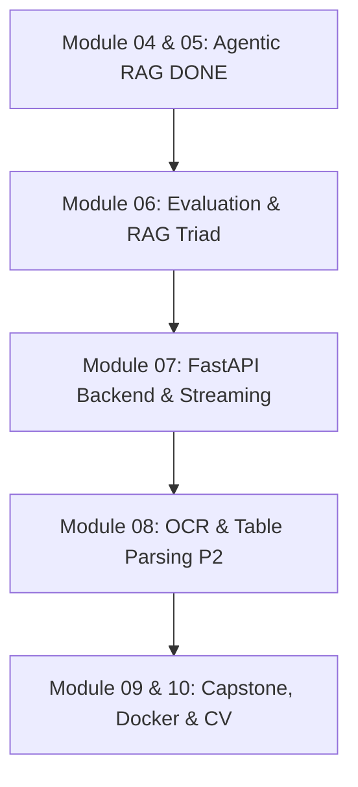

# Master Roadmap & Enterprise Architecture Plan

Tài liệu này tổng hợp toàn bộ kế hoạch triển khai tổng thể từ Module 06 đến Module 10 cho hệ thống **Enterprise Document Intelligence Platform**.

---

## 1. Kiểm kê Tính năng Hệ thống (Feature Inventory)

| Khái niệm / Feature | Trạng thái hiện tại | Vị trí File Code / Ghi chú |
|---|---|---|
| **Self-Corrective RAG** | ✅ **ĐÃ LÀM** | `app/graph/corrective_rag.py` & `app/graph/agentic_rag.py` Tự chấm điểm độ liên quan (Grade), nếu không khớp thì tự động viết lại câu hỏi (Rewrite Query) và tìm kiếm lại. |
| **Agentic Router Decision** | ✅ **ĐÃ LÀM** | `app/generation/generator.py` (`analyze_intent_and_decide`) Dùng Pydantic Structured Output để LLM tự quyết định 3 chiến lược (`direct_answer`, `retrieve_vector`, `retrieve_hybrid`). |
| **Verification Subagent** | ✅ **ĐÃ LÀM** | `app/generation/generator.py` (`verify_answer_groundedness`) Subagent chuyên biệt giám định tính trung thực của câu trả lời (Anti-Hallucination Check: `grounded` vs `hallucinated`). |
| **Multi-Agent (Supervisor)** | 🟡 **ĐÃ LÀM DẠNG NHẸ (RECOMMENDED)** | Hệ thống dạng Agent Router + Verification Subagent. Chưa làm dạng Multi-Agent giao tiếp phức tạp (dạng P1/Over-engineering). |
| **Tool Calling (Python @tool)** | 🟡 **ĐÃ LÀM DẠNG ROUTER TOOL** | Đã làm dạng Pydantic Structured Output Decision. Có thể mở rộng lên LangChain `@tool` / Gemini Native Function Calling nếu cần. |
| **GraphRAG (Knowledge Graph)** | ❌ **CHƯA LÀM (P2 / Optional)** | Thuộc P2 (không làm MVP trong 2 ngày vì tốn thời gian setup Neo4j). Chỉ cần nắm lý thuyết đi phỏng vấn. |
| **MCP (Model Context Protocol)** | ❌ **CHƯA LÀM (P2 / Optional)** | Thuộc P2 (Không cần thiết vì app có API riêng, không cần expose tool cho Claude Desktop). |

---

## 2. Kế hoạch Triển khai các Module Tiếp theo (Master Roadmap)

### Phase 1: Module 06 — Evaluation & Benchmarking (Tiếp theo)
* **Mục tiêu:** Đo lường độ chính xác của hệ thống RAG hiện tại bằng bộ chỉ số RAG Triad.
* **Nhiệm vụ:**
  1. Tạo bộ testset 20-30 câu hỏi kèm câu trả lời chuẩn (Ground Truth).
  2. Đo chỉ số *Faithfulness* (chống hallucination), *Answer Relevance*, *Context Precision*.

### Phase 2: Module 07 — API Backend & Streaming
* **Mục tiêu:** Đóng gói Đồ thị LangGraph thành RESTful API phục vụ Web Frontend.
* **Nhiệm vụ:**
  1. Xây dựng API bằng **FastAPI** (Async, Pydantic).
  2. Hỗ trợ **Streaming SSE (Server-Sent Events)** trả lời mượt từng từ.
  3. Tích hợp **Redis Cache** cho câu hỏi lặp lại.

### Phase 3: Module 08 — OCR & Table Extraction (P2)
* **Mục tiêu:** Xử lý các file PDF scan từ máy photo hoặc file ảnh chứa bảng biểu.
* **Nhiệm vụ:**
  1. Tích hợp công cụ OCR (`pdf2image` + `pytesseract` / `paddleocr` / `unstructured`).
  2. Chuyển đổi bảng biểu thành Markdown Table trước khi cắt chunk.

### Phase 4: Module 09 & 10 — Enterprise Fullstack, Docker & Capstone
* **Mục tiêu:** Hoàn thiện sản phẩm Enterprise SaaS, Phân quyền RBAC, Dockerize và tạo CV ấn tượng.
* **Nhiệm vụ:**
  1. Xây dựng giao diện Web Frontend (React / Next.js / HTML+JS).
  2. Tích hợp Phân quyền (RBAC): User phòng Kế toán chỉ hỏi dữ liệu Tài chính, User HR chỉ hỏi dữ liệu Nhân sự.
  3. Đóng gói ứng dụng bằng **Docker Compose**.
  4. Đưa dự án vào CV với các con số đo lường thực tế từ Module 06.

### Phase 5: Advanced Extensions — GraphRAG & MCP Server (Mở rộng Nâng cao)
* **1. GraphRAG Extension (Knowledge Graph Retrieval):**
  * Tích hợp thêm nguồn `retrieve_graph` bên cạnh `retrieve_vector` và `retrieve_hybrid` bằng NetworkX/Neo4j.
  * Phục vụ các câu hỏi tổng hợp mối quan hệ liên văn bản ("kết nối các điểm" giữa nhiều thực thể).
* **2. MCP Server Extension (Model Context Protocol):**
  * Tạo file `mcp_server.py` bằng `mcp` Python SDK để biến bộ retriever của bạn thành một MCP Server chuẩn.
  * Cho phép các công cụ bên ngoài (như Claude Desktop, Cursor, AI Clients) kết nối thẳng vào database RAG của bạn.
