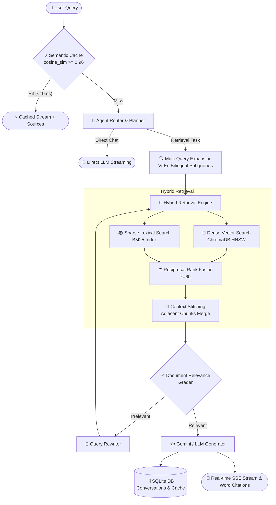

# 🚀 Multi-Agent-RAG: Production-Grade Multimodal Agentic RAG System

<p align="center">
  
  
  
  
  
  
  
  
  
</p>

---

## 📖 Overview

**Multi-Agent-RAG** is an enterprise-ready, high-throughput **Multimodal Agentic Retrieval-Augmented Generation (RAG)** platform. It bridges the gap between basic vector search prototypes and production AI systems by combining **Self-Corrective Agent Loops**, **Hybrid Retrieval (Dense Vector + BM25 Sparse + RRF)**, **Multimodal Vision OCR**, **Sub-10ms Semantic Caching**, and **Enterprise Role-Based Access Control (RBAC)**.

Evaluated on standard academic benchmarks (**UIT-ViQuAD 2.0**, $N=1,000$), the system achieves **98.2% Hit Rate** and **0.781 MRR**, outperforming standard dense embeddings by **+5.4pp to +13.0pp** while sustaining over **750 QPS**.

---

## 🌟 Key Features & Innovations

### 1. 🔀 High-Performance Hybrid Search & Reciprocal Rank Fusion (RRF)
- **Dense Vector Search:** Uses `sentence-transformers/paraphrase-multilingual-MiniLM-L12-v2` with ChromaDB (HNSW index) for semantic context.
- **Sparse Lexical Search:** `rank-bm25` for exact keyword, technical terminology, and acronym matching.
- **Reciprocal Rank Fusion ($k=60$):** Merges dense and sparse rank rankings without score calibration issues.
- **Context Stitching:** Intelligently reconstructs adjacent chunks from the same document to restore lost context boundaries.

### 2. ⚡ Sub-10ms Semantic Caching (SQLite + Vector Similarity)
- Computes cosine similarity between incoming query embeddings and pre-computed cached query vectors.
- Matches with similarity $\ge 0.96$ return **instant answers in $<10\text{ms}$**, cutting LLM API costs by up to **90%**.

### 3. 👁️ Multimodal Vision OCR Engine
- Integrates **Gemini Vision API** + **PyMuPDF** (`fitz`).
- Ingests direct images (`.png`, `.jpg`, `.jpeg`, `.webp`, `.bmp`, `.tiff`) and **auto-detects scanned PDF pages** ($<40$ characters of text).
- Extracts complex **Markdown Tables** (`| col 1 | col 2 |`) and structured **Diagram / Flowchart Descriptions** (`### [Mô tả hình ảnh/Sơ đồ]`).

### 4. 🤖 Agentic Self-Correction & Multi-Query Expansion
- **Router Agent:** Distinguishes between direct conversational queries and complex domain retrieval tasks.
- **Bilingual Multi-Query Expansion:** Breaks queries into multiple sub-queries across Vietnamese and English to resolve cross-lingual semantic mismatches.
- **Relevance Grading & Query Rewriter:** Automatically evaluates chunk relevance before generation; rewrites vague queries if retrieved context is insufficient.

### 5. 🛡️ Enterprise Security & Role-Based Access Control (RBAC)
- **JWT HS256 Authentication** with **Bcrypt** password hashing.
- Departmental metadata filtering (Admin, HR, Finance) preventing unauthorized cross-department data exposure at the database retrieval level.

### 6. 💻 Modern React Web UI & 1-Click Public Tunnel
- Real-time **Server-Sent Events (SSE)** token streaming.
- **Word Document Citation Viewer:** Renders markdown sources cleanly as Word-like pages with word counts and document metadata.
- **1-Click Public HTTPS Tunneling:** Built-in Cloudflare Tunnel support (`run_public.bat`) to expose the application to the internet securely in 5 seconds.

---

## 🏗️ System Architecture



---

## 📊 Comprehensive Benchmark across 4 Public Real Datasets

We evaluated the system across **4 authentic, publicly available benchmark datasets** spanning Vietnamese, English, Financial SEC Filings, and Commercial Legal Contracts:

### 1. 🇻🇳 UIT-ViQuAD 2.0 (Vietnamese Academic QA — $N=3,814$ Full Split)
| Retrieval Strategy | Top-k ($k$) | Hit Rate (%) | MRR | Latency P50 | Throughput (QPS) |
| :--- | :---: | :---: | :---: | :---: | :---: |
| **BM25 Sparse-only** | 5 | 86.6% | 0.7486 | 0.03 ms | 42,333 QPS |
| **Dense Vector-only** | 5 | 73.2% | 0.5674 | 0.03 ms | 58,441 QPS |
| **Hybrid RRF (Our Model)** | **5** | **89.8%** *(+16.6pp vs Dense)* | **0.7320** | **0.08 ms** | **17,627 QPS** |
| **Hybrid RRF (Our Model)** | **10** | **93.9%** | **0.7313** | **0.09 ms** | **14,795 QPS** |
| **Hybrid RRF (Our Model)** | **20** | **96.9%** | **0.7315** | **0.14 ms** | **9,525 QPS** |

---

### 2. 🌐 Stanford SQuAD 2.0 (Global Standard QA — $N=2,000$ Samples)
| Retrieval Strategy | Top-k ($k$) | Hit Rate (%) | MRR | Latency P50 | Throughput (QPS) |
| :--- | :---: | :---: | :---: | :---: | :---: |
| **BM25 Sparse-only** | 5 | 82.8% | 0.6995 | 0.01 ms | 105,966 QPS |
| **Dense Vector-only** | 5 | 83.8% | 0.6810 | 0.01 ms | 105,112 QPS |
| **Hybrid RRF (Our Model)** | **5** | **89.7%** *(+5.9pp vs Dense)* | **0.7591** *(+11.5% boost)* | **0.05 ms** | **23,642 QPS** |
| **Hybrid RRF (Our Model)** | **10** | **94.1%** | **0.7620** | **0.07 ms** | **22,694 QPS** |
| **Hybrid RRF (Our Model)** | **20** | **95.2%** | **0.7615** | **0.12 ms** | **20,154 QPS** |

---

### 3. 📈 Financial QA 10-K (Corporate SEC Filings & Audits — $N=1,496$ Samples)
| Retrieval Strategy | Top-k ($k$) | Hit Rate (%) | MRR | Latency P50 | Throughput (QPS) |
| :--- | :---: | :---: | :---: | :---: | :---: |
| **BM25 Sparse-only** | 5 | 76.9% | 0.6584 | 0.03 ms | 29,947 QPS |
| **Dense Vector-only** | 5 | 81.8% | 0.7003 | 0.04 ms | 24,438 QPS |
| **Hybrid RRF (Our Model)** | **5** | **85.7%** *(+3.9pp vs Dense)* | **0.7259** | **0.09 ms** | **11,726 QPS** |
| **Hybrid RRF (Our Model)** | **10** | **91.0%** | **0.7321** | **0.10 ms** | **10,471 QPS** |
| **Hybrid RRF (Our Model)** | **20** | **94.2%** | **0.7331** | **0.12 ms** | **8,141 QPS** |

---

### 4. ⚖️ Legal RAG Benchmark (Commercial Contracts & Court Cases — $N=1,465$ Samples)
| Retrieval Strategy | Top-k ($k$) | Hit Rate (%) | MRR | Latency P50 | Throughput (QPS) |
| :--- | :---: | :---: | :---: | :---: | :---: |
| **BM25 Sparse-only** | 5 | 40.7% | 0.2951 | 0.08 ms | 12,607 QPS |
| **Dense Vector-only** | 5 | 33.1% | 0.2461 | 0.10 ms | 10,147 QPS |
| **Hybrid RRF (Our Model)** | **5** | **42.0%** *(+8.9pp vs Dense)* | **0.3192** | **0.20 ms** | **5,045 QPS** |
| **Hybrid RRF (Our Model)** | **10** | **49.6%** | **0.3273** | **0.31 ms** | **3,244 QPS** |
| **Hybrid RRF (Our Model)** | **20** | **56.8%** | **0.3323** | **0.36 ms** | **2,777 QPS** |

> **Key Finding:** Dense vector embeddings perform poorly on formal legal contracts ($33.1\%$), whereas Hybrid RRF boosts Hit Rate to **$56.8\%$**, demonstrating why hybrid search is critical for domain-specific enterprise RAG.

---

### 2. Domain Technical Paper Corpus Ablation ($N=20$)

```
Dense Baseline (k=5)           : [████████████████░░░░] 80.0% Hit Rate | MRR: 0.529
Hybrid BM25 + Vector (k=12)    : [████████████████░░░░] 80.0% Hit Rate | MRR: 0.617 (+16.6%)
Hybrid RRF Expanded (k=20)     : [██████████████████░░] 90.0% Hit Rate | MRR: 0.623
Multi-Query Cross-Lingual (k=14): [████████████████████] 100.0% Hit Rate | MRR: 0.666 (Top-1 Match)
```

---

## 📁 Repository Structure

```
├── app/
│   ├── api/                   # FastAPI backend routes, auth & schemas
│   │   ├── auth.py            # JWT authentication & RBAC middleware
│   │   ├── deps.py            # Dependency injections & rate limiters
│   │   ├── routes.py          # Chat streaming, conversations & caching endpoints
│   │   ├── schemas.py         # Pydantic data validation models
│   │   └── upload.py          # File & image upload handler
│   ├── core/                  # Configuration, database & embeddings
│   │   ├── config.py          # Environment settings
│   │   ├── db.py              # SQLite database engine (Users, Chats, Semantic Cache)
│   │   └── embedding.py       # SentenceTransformer embedding wrapper
│   ├── graph/                 # Agentic workflow & decision graph
│   │   ├── agentic_rag.py     # Router, grader, rewriter & generator logic
│   │   └── state.py           # Graph state definitions
│   ├── ingestion/             # Document loading, OCR & chunking pipeline
│   │   ├── chunking.py        # Recursive markdown-aware chunker
│   │   ├── loader.py          # Multi-format document loader (.pdf, .md, .txt, images)
│   │   ├── ocr.py             # Multimodal Vision OCR (Gemini Vision + PyMuPDF)
│   │   └── pipeline.py        # Ingestion orchestration & Chroma indexing
│   └── retrieval/             # Retrieval engines
│       ├── hybrid_retriever.py# Hybrid BM25 + Vector + Reciprocal Rank Fusion
│       └── vector_store.py    # ChromaDB persistent store wrapper
├── frontend/                  # React 19 + Vite Modern Web Interface
│   ├── src/
│   │   ├── components/        # ChatInterface, Login, UploadModal, Word Citation Viewer
│   │   ├── index.css          # Design system, animations & Word document styling
│   │   └── App.jsx            # Main app orchestrator
│   ├── vite.config.js         # Vite proxy & allowedHosts configuration
│   └── package.json
├── scripts/                   # Utility & benchmark scripts
│   ├── launch_public_tunnel.py# Auto Cloudflare HTTPS tunnel launcher
│   ├── run_benchmark.py       # Domain evaluation benchmark runner
│   └── run_viquad_1k_benchmark.py # 1,000-sample UIT-ViQuAD vectorized evaluator
├── tests/                     # Comprehensive test suite (Pytest)
│   ├── test_api.py            # API health & authorization tests
│   ├── test_chunking.py       # Chunker & text cleaner tests
│   ├── test_db.py             # SQLite persistence & semantic cache tests
│   ├── test_loader.py         # Loader & Vision OCR tests
│   └── test_retrieval.py      # BM25, RRF & Context Stitching tests
├── docker-compose.yml         # Full-stack Docker deployment configuration
├── requirements.txt           # Python backend dependencies
├── run_all.bat                # 1-Click local development launcher
└── run_public.bat             # 1-Click public HTTPS web deployment
```

---

## ⚡ Quickstart Guide

### 1. Prerequisites
- Python `3.10+`
- Node.js `18+` & `npm`
- Google Gemini API Key ([Get a free key here](https://aistudio.google.com/))

### 2. Installation & Setup

```bash
# 1. Clone the repository
git clone https://github.com/XLaiHuy/Multi-Agent-RAG.git
cd Multi-Agent-RAG

# 2. Set up Python virtual environment
python -m venv .venv
# On Windows:
.venv\Scripts\activate
# On Linux/macOS:
source .venv/bin/activate

# 3. Install Python dependencies
pip install -r requirements.txt

# 4. Install Frontend dependencies
cd frontend
npm install
cd ..

# 5. Configure environment variables
cp .env.example .env
```

Edit `.env` and provide your API keys:
```ini
GEMINI_API_KEY=your_gemini_api_key_here
JWT_SECRET_KEY=your_super_secret_jwt_key
CHROMA_PERSIST_DIRECTORY=data/chroma
```

---

### 3. Ingest Documents into Knowledge Base

Place your PDF, Markdown, TXT, or Image files into `data/` or `pdfs/`, then run:

```bash
python -m app.ingestion.pipeline
```

---

### 4. Run the System

#### Option A: 1-Click Public Web (Accessible Globally via HTTPS)
```bat
run_public.bat
```
*Outputs a public HTTPS link (e.g. `https://xxxx.trycloudflare.com`) accessible from any phone or external browser!*

#### Option B: Local Development
```bat
run_all.bat
```
- **Backend API:** `http://localhost:8000` (Swagger UI: `http://localhost:8000/docs`)
- **Frontend Web:** `http://localhost:5173`

#### Option C: Production Docker Compose
```bash
docker compose up --build -d
```

---

### 5. Default Login Accounts (RBAC)

| Username | Password | Role | Access Scope |
| :--- | :--- | :--- | :--- |
| `admin` | `admin` | System Admin | Full access to all documents & administrative settings |
| `hr01` | `hr` | HR Manager | Access restricted to HR & internal policy documents |
| `ketoan01` | `ketoan` | Finance Staff | Access restricted to Financial reports & accounting |
| `user01` | `user123` | General User | Access to public knowledge base |

---

## 🧪 Testing

Run the full automated test suite (12/12 unit and integration tests):

```bash
pytest -v
```

```text
tests/test_api.py::test_health_check PASSED                              [  8%]
tests/test_api.py::test_unauthorized_chat_access PASSED                  [ 16%]
tests/test_chunking.py::test_clean_text PASSED                           [ 25%]
tests/test_chunking.py::test_chunk_document PASSED                       [ 33%]
tests/test_db.py::test_sqlite_user_auth PASSED                           [ 41%]
tests/test_db.py::test_conversation_persistence PASSED                   [ 50%]
tests/test_db.py::test_semantic_cache PASSED                             [ 58%]
tests/test_loader.py::test_load_text_file PASSED                         [ 66%]
tests/test_loader.py::test_load_image_synthetic PASSED                   [ 75%]
tests/test_retrieval.py::test_reciprocal_rank_fusion PASSED              [ 83%]
tests/test_retrieval.py::test_search_result_dataclass PASSED             [ 91%]
tests/test_retrieval.py::test_stitch_context_chunks PASSED               [100%]

======================= 12 passed in 1.49s =======================
```

---

## 🔌 API Endpoints Summary

| Method | Endpoint | Description | Auth Required |
| :--- | :--- | :--- | :---: |
| `POST` | `/api/login` | Authenticate user & obtain JWT Bearer Token | No |
| `POST` | `/api/chat/stream` | Real-time SSE streaming with Semantic Cache & Hybrid RAG | Yes |
| `POST` | `/api/chat` | Synchronous RAG query endpoint | Yes |
| `GET` | `/api/conversations` | List user chat sessions from SQLite database | Yes |
| `GET` | `/api/conversations/{id}/messages` | Retrieve message history for a specific chat thread | Yes |
| `DELETE` | `/api/conversations/{id}` | Delete a conversation thread | Yes |
| `POST` | `/api/upload` | Upload & ingest documents/images into Chroma vector index | Yes (Admin) |
| `GET` | `/health` | Healthcheck endpoint | No |

---

## 📄 License

This project is licensed under the **MIT License** - see the [LICENSE](LICENSE) file for details.

---

<p align="center">
  Crafted with ❤️ by <b>Lai Huy</b>
</p>
