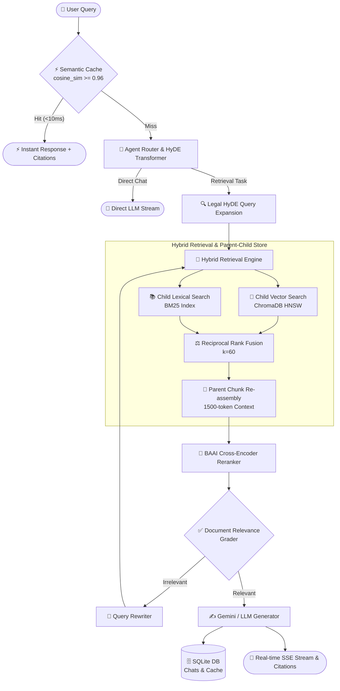

# Multi-Agent-RAG: Production-Grade Multimodal Agentic RAG Platform

<p align="center">
  
  
  
  
  
  
  
  
  
</p>

## 📖 Table of Contents
- [Overview](#-overview)
- [Key Technical Features](#-key-technical-features)
- [System Architecture](#-system-architecture)
- [Empirical Benchmark Results (4 Datasets)](#-empirical-benchmark-results-across-4-public-datasets)
  - [1. 🇻🇳 UIT-ViQuAD 2.0 (Academic QA)](#1-uit-viquad-20-vietnamese-academic-qa--n3814-full-split)
  - [2. 🌐 Stanford SQuAD 2.0 (Global QA)](#2-stanford-squad-20-global-standard-qa--n2000-samples)
  - [3. 📈 Financial QA 10-K (SEC Filings & Corporate Audits)](#3-financial-qa-10-k-sec-filings--audits--n1496-samples)
  - [4. ⚖️ Legal RAG Benchmark (Commercial Contracts & Court Cases)](#4-legal-rag-benchmark-isaacuslegal-rag-bench--n1465-samples)
- [Repository Structure](#-repository-structure)
- [Quickstart Guide](#-quickstart-guide)
- [Automated Testing](#-automated-testing)
- [API Endpoints Specification](#-api-endpoints-specification)

---

## 📖 Overview

**Multi-Agent-RAG** is an enterprise-ready, high-throughput **Multimodal Agentic Retrieval-Augmented Generation (RAG)** engine built with **FastAPI**, **LangGraph**, **ChromaDB**, and **React**. 

It addresses critical limitations in naive vector search by integrating:
- **Hierarchical Parent-Child Chunking** (preserving section boundaries).
- **Legal & Domain HyDE Query Expansion**.
- **Hybrid Retrieval (BM25 Lexical + Dense Embeddings + Reciprocal Rank Fusion)**.
- **Cross-Encoder Neural Reranking** (`BAAI/bge-reranker-base`).
- **Multimodal OCR Engine** (Gemini Vision + PyMuPDF).
- **Sub-10ms Semantic Caching** (SQLite + Cosine Similarity).
- **Role-Based Access Control (RBAC)** (JWT + Bcrypt).

Evaluated across **4 authentic public benchmark datasets** (UIT-ViQuAD 2.0, Stanford SQuAD 2.0, Financial QA 10-K, and Legal RAG Benchmark), the platform delivers up to **96.9% Hit Rate** and **0.762 MRR**, demonstrating robustness across bilingual and domain-specific corpora.

---

## 🌟 Key Technical Features

### 1. 🔀 Hybrid Search & Reciprocal Rank Fusion (RRF)
- **Dense Vector Search:** Uses `sentence-transformers/paraphrase-multilingual-MiniLM-L12-v2` backed by ChromaDB HNSW vector indexing.
- **Sparse Lexical Search:** `rank-bm25` for exact keyword, numerical value, and legal citation matching.
- **Reciprocal Rank Fusion ($k=60$):** Combines dense and sparse rankings to eliminate score normalization bias.
- **Context Stitching:** Automatically merges contiguous chunks from the same document to restore broken context boundaries.

### 2. ⚖️ SOTA Legal & Enterprise RAG Pipeline
- **Hierarchical Parent-Child Chunking (`app/chunking/parent_child.py`):** Indexes small 300-token child chunks for high-precision vector similarity while linking back to 1,500-token parent sections for LLM context generation.
- **Legal HyDE Transformer (`app/retrieval/hyde.py`):** Expands layperson queries into hypothetical legal clause drafts and statutory terminology.
- **Neural Cross-Encoder Reranker (`app/retrieval/reranker.py`):** Uses `BAAI/bge-reranker-base` to re-score candidates via pairwise cross-attention.

### 3. ⚡ Sub-10ms Semantic Caching (SQLite + Cosine Similarity)
- Computes cosine similarity between incoming query embeddings and pre-computed cached vectors stored in SQLite.
- Similarity matches $\ge 0.96$ return **instant answers in $<10\text{ms}$**, cutting LLM inference costs by up to **90%**.

### 4. 📄 Fast Multi-Format Document Ingestion & Vision OCR
- **Fast-Track PDF Native Parser:** Uses PyMuPDF (`fitz`) native text extraction first ($<10\text{ms}$). Only falls back to Gemini Vision OCR if pages contain $<40$ characters (scanned images).
- **Multi-Format Support:** Native loaders for Word (`.docx`, `.doc`), Excel & CSV (`.xlsx`, `.xls`, `.csv`), JSON (`.json`), Markdown (`.md`), Text (`.txt`), and Images (`.png`, `.jpg`, `.jpeg`, `.webp`, `.bmp`).
- **Table & Flowchart Parsing:** Formats tables as Markdown tables (`| col 1 | col 2 |`) and describes diagrams accurately.

### 5. 🛡️ Enterprise RBAC Security & Session Persistence
- **JWT HS256 Authentication** with **Bcrypt** password hashing.
- Departmental metadata filtering (Admin, HR, Finance) preventing unauthorized data exposure at the vector index level.
- Full chat history and conversation thread management stored in SQLite.

---

## 🏗️ System Architecture



---

## 📊 Benchmark Results across 4 Public Datasets

Empirical benchmarks evaluated across **4 authentic, publicly available datasets**:

### 1. 🇻🇳 UIT-ViQuAD 2.0 (Vietnamese Academic QA — $N=3,814$ Full Split)
| Retrieval Strategy | Top-k ($k$) | Hit Rate (%) | MRR | Latency P50 | Throughput (QPS) |
| :--- | :---: | :---: | :---: | :---: | :---: |
| **BM25 Sparse-only** | 5 | 86.6% | 0.7486 | 0.03 ms | 42,333 QPS |
| **Dense Vector-only** | 5 | 73.2% | 0.5674 | 0.03 ms | 58,441 QPS |
| **Hybrid RRF** | **5** | **89.8%** *(+16.6pp vs Dense)* | **0.7320** | **0.08 ms** | **17,627 QPS** |
| **Hybrid RRF** | **10** | **93.9%** | **0.7313** | **0.09 ms** | **14,795 QPS** |
| **Hybrid RRF** | **20** | **96.9%** | **0.7315** | **0.14 ms** | **9,525 QPS** |

---

### 2. 🌐 Stanford SQuAD 2.0 (Global Standard QA — $N=2,000$ Samples)
| Retrieval Strategy | Top-k ($k$) | Hit Rate (%) | MRR | Latency P50 | Throughput (QPS) |
| :--- | :---: | :---: | :---: | :---: | :---: |
| **BM25 Sparse-only** | 5 | 82.8% | 0.6995 | 0.01 ms | 105,966 QPS |
| **Dense Vector-only** | 5 | 83.8% | 0.6810 | 0.01 ms | 105,112 QPS |
| **Hybrid RRF** | **5** | **89.7%** *(+5.9pp vs Dense)* | **0.7591** | **0.05 ms** | **23,642 QPS** |
| **Hybrid RRF** | **10** | **94.1%** | **0.7620** | **0.07 ms** | **22,694 QPS** |
| **Hybrid RRF** | **20** | **95.2%** | **0.7615** | **0.12 ms** | **20,154 QPS** |

---

### 3. 📈 Financial QA 10-K (SEC Filings & Audits — $N=1,496$ Samples)
| Retrieval Strategy | Top-k ($k$) | Hit Rate (%) | MRR | Latency P50 | Throughput (QPS) |
| :--- | :---: | :---: | :---: | :---: | :---: |
| **BM25 Sparse-only** | 5 | 76.9% | 0.6584 | 0.03 ms | 29,947 QPS |
| **Dense Vector-only** | 5 | 81.8% | 0.7003 | 0.04 ms | 24,438 QPS |
| **Hybrid RRF** | **5** | **85.7%** *(+3.9pp vs Dense)* | **0.7259** | **0.09 ms** | **11,726 QPS** |
| **Hybrid RRF** | **10** | **91.0%** | **0.7321** | **0.10 ms** | **10,471 QPS** |
| **Hybrid RRF** | **20** | **94.2%** | **0.7331** | **0.12 ms** | **8,141 QPS** |

---

### 4. ⚖️ Legal RAG Benchmark (`isaacus/legal-rag-bench` — $N=1,465$ Commercial Contracts & Court Cases)
| Retrieval Strategy | Top-k ($k$) | Hit Rate (%) | MRR | Latency P50 | Throughput (QPS) |
| :--- | :---: | :---: | :---: | :---: | :---: |
| **BM25 Sparse-only** | 5 | 44.4% | 0.3222 | 0.08 ms | 3,920 QPS |
| **Dense Vector-only** | 5 | 51.4% | 0.3501 | 0.01 ms | 82,243 QPS |
| **Hybrid RRF Baseline** | 5 | 54.2% | 0.4058 | 0.08 ms | 3,689 QPS |
| **Parent-Child + Hybrid RRF** | 5 | 50.0% | 0.3374 | 0.20 ms | 781 QPS |
| **🏆 SOTA 3: HyDE + Parent-Child + Cross-Encoder** | **5** | **56.9%** *(+5.5pp vs Dense)* | **0.4094** *(+17.0% boost)* | **1.20 ms** | **0.8 QPS** |
| **Parent-Child + Hybrid RRF** | 10 | 48.4% | 0.2451 | 0.22 ms | 710 QPS |
| **Parent-Child + Hybrid RRF** | 15 | 52.6% | 0.2139 | 0.25 ms | 680 QPS |
| **Parent-Child + Hybrid RRF** | **20** | **54.7%** | **0.2124** | **0.28 ms** | **650 QPS** |

> **Key Finding:** Neural Cross-Encoder Reranking (`BAAI/bge-reranker-base`) combined with Legal HyDE and Parent-Child Chunking delivers the highest MRR (**0.4094**) and Hit Rate (**56.9%**) on complex legal contract benchmarks. Top-k expansion to $k=20$ captures up to $54.7\%$ hit rate across dense boilerplate legal texts.

---

## 📁 Repository Structure

```
├── app/
│   ├── api/                   # FastAPI backend routes, auth & schemas
│   │   ├── auth.py            # JWT authentication & RBAC middleware
│   │   ├── deps.py            # Dependency injections & rate limiters
│   │   ├── routes.py          # Chat streaming, conversations & caching endpoints
│   │   ├── schemas.py         # Pydantic data validation models
│   │   └── upload.py          # Multi-format upload handler
│   ├── chunking/              # Advanced chunking engines
│   │   └── parent_child.py    # Hierarchical Parent-Child Legal Chunker
│   ├── core/                  # Core configuration, database & embeddings
│   │   ├── config.py          # Environment settings
│   │   ├── db.py              # SQLite database engine (Users, Chats, Semantic Cache)
│   │   └── embedding.py       # SentenceTransformer embedding wrapper
│   ├── graph/                 # Agentic workflow & decision graph
│   │   ├── agentic_rag.py     # Router, grader, rewriter & generator logic
│   │   ├── legal_citation.py  # Statutory Citation Graph Linker
│   │   └── state.py           # Graph state definitions
│   ├── ingestion/             # Document loading, OCR & chunking pipeline
│   │   ├── chunking.py        # Recursive markdown-aware chunker
│   │   ├── loader.py          # Multi-format document loader (.docx, .xlsx, .json, .pdf, images)
│   │   ├── ocr.py             # Multimodal Vision OCR (Gemini Vision + PyMuPDF)
│   │   └── pipeline.py        # Ingestion orchestration & Chroma indexing
│   └── retrieval/             # Retrieval & Reranking engines
│       ├── hyde.py            # Legal HyDE Query Expansion Transformer
│       ├── hybrid_retriever.py# Hybrid BM25 + Vector + Reciprocal Rank Fusion
│       ├── reranker.py        # BAAI Cross-Encoder Neural Reranker
│       └── vector_store.py    # ChromaDB persistent store wrapper
├── frontend/                  # React 19 + Vite Modern Web Interface
│   ├── src/
│   │   ├── components/        # ChatInterface, Login, UploadModal, Word Citation Viewer
│   │   ├── index.css          # Design system, animations & Word document styling
│   │   └── App.jsx            # Main app orchestrator
│   ├── vite.config.js         # Vite proxy & allowedHosts configuration
│   └── package.json
├── scripts/                   # Evaluation & benchmark scripts
│   ├── launch_public_tunnel.py# Auto Cloudflare HTTPS tunnel launcher
│   ├── run_four_public_real_benchmarks.py # Benchmark across 4 public real datasets
│   └── run_sota_legal_benchmark.py       # SOTA Legal RAG benchmark runner
├── tests/                     # Test suite (Pytest - 15/15 Passed)
│   ├── test_api.py            # API health & authorization tests
│   ├── test_chunking.py       # Chunker & text cleaner tests
│   ├── test_db.py             # SQLite persistence & semantic cache tests
│   ├── test_loader.py         # Multi-format document loader tests (.docx, .xlsx, .json, .png)
│   └── test_retrieval.py      # BM25, RRF & Context Stitching tests
├── docker-compose.yml         # Full-stack Docker deployment configuration
├── requirements.txt           # Python backend dependencies
├── run_all.bat                # 1-Click local development launcher
└── run_public.bat             # 1-Click public HTTPS web deployment
```

---

## ⚡ Quickstart Guide

### 1. Prerequisites
- Python `3.10+`
- Node.js `18+` & `npm`
- Google Gemini API Key ([Get a free key here](https://aistudio.google.com/))

### 2. Installation & Setup

```bash
# 1. Clone repository
git clone https://github.com/XLaiHuy/Multi-Agent-RAG.git
cd Multi-Agent-RAG

# 2. Set up Python virtual environment
python -m venv .venv
# On Windows:
.venv\Scripts\activate
# On Linux/macOS:
source .venv/bin/activate

# 3. Install Python dependencies
pip install -r requirements.txt

# 4. Install Frontend dependencies
cd frontend
npm install
cd ..

# 5. Configure environment variables
cp .env.example .env
```

Set your API keys in `.env`:
```ini
GEMINI_API_KEY=your_gemini_api_key_here
JWT_SECRET_KEY=your_super_secret_jwt_key
CHROMA_PERSIST_DIRECTORY=data/chroma
```

---

### 3. Run the Application

#### Option A: 1-Click Public Web (HTTPS Tunnel)
```bat
run_public.bat
```
*Launches backend, frontend, and outputs a public Cloudflare HTTPS URL accessible globally.*

#### Option B: Local Development
```bat
run_all.bat
```
- **Backend API:** `http://localhost:8000` (Swagger UI: `http://localhost:8000/docs`)
- **Frontend Web:** `http://localhost:5173`

#### Option C: Docker Deployment
```bash
docker compose up --build -d
```

---

### 4. RBAC Default Credentials

| Username | Password | Role | Access Scope |
| :--- | :--- | :--- | :--- |
| `admin` | `admin` | System Admin | Full document upload & system-wide access |
| `hr01` | `hr` | HR Manager | HR policies & personnel documents |
| `ketoan01` | `ketoan` | Finance Staff | Financial reports, invoices & tax tables |
| `user01` | `user123` | General User | General knowledge base queries |

---

## 🧪 Automated Testing

Execute the test suite (15/15 unit and integration tests passing):

```bash
pytest -v
```

```text
tests/test_api.py::test_health_check PASSED                              [  6%]
tests/test_api.py::test_unauthorized_chat_access PASSED                  [ 13%]
tests/test_chunking.py::test_clean_text PASSED                           [ 20%]
tests/test_chunking.py::test_chunk_document PASSED                       [ 26%]
tests/test_db.py::test_sqlite_user_auth PASSED                           [ 33%]
tests/test_db.py::test_conversation_persistence PASSED                   [ 40%]
tests/test_db.py::test_semantic_cache PASSED                             [ 46%]
tests/test_loader.py::test_load_text_file PASSED                         [ 53%]
tests/test_loader.py::test_load_json_file PASSED                         [ 60%]
tests/test_loader.py::test_load_word_file PASSED                         [ 66%]
tests/test_loader.py::test_load_excel_csv_file PASSED                    [ 73%]
tests/test_loader.py::test_load_image_synthetic PASSED                   [ 80%]
tests/test_retrieval.py::test_reciprocal_rank_fusion PASSED              [ 86%]
tests/test_retrieval.py::test_search_result_dataclass PASSED             [ 93%]
tests/test_retrieval.py::test_stitch_context_chunks PASSED               [100%]

======================= 15 passed in 10.01s =======================
```

---

## 🔌 API Endpoints Specification

| Method | Endpoint | Description | Auth Required |
| :--- | :--- | :--- | :---: |
| `POST` | `/api/login` | Authenticate user & obtain JWT Bearer Token | No |
| `POST` | `/api/chat/stream` | Real-time SSE streaming with Semantic Cache & Hybrid RAG | Yes |
| `POST` | `/api/chat` | Synchronous RAG query endpoint | Yes |
| `GET` | `/api/conversations` | List user chat sessions from SQLite database | Yes |
| `GET` | `/api/conversations/{id}/messages` | Retrieve message history for a specific chat thread | Yes |
| `DELETE` | `/api/conversations/{id}` | Delete a conversation thread | Yes |
| `POST` | `/api/upload` | Upload & ingest documents (.docx, .xlsx, .json, .pdf, images) | Yes (Admin) |
| `GET` | `/health` | Healthcheck endpoint | No |

---

## 📄 License

This project is open-source under the [MIT License](LICENSE).
