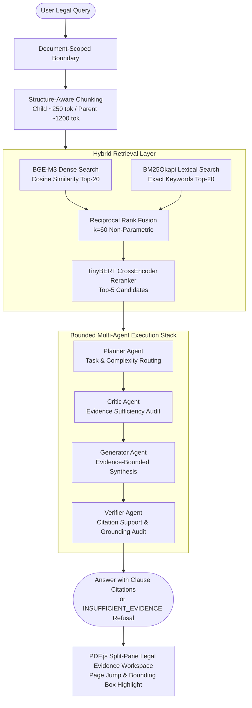

# Multi-Agent Safe-RAG: Enterprise Document-Scoped Legal Intelligence Pipeline

[](https://www.python.org/downloads/)
[](https://fastapi.tiangolo.com)
[](https://react.dev)
[](https://tanstack.com/query)
[](https://mozilla.github.io/pdf.js/)
[](https://huggingface.co/BAAI/bge-m3)
[](tests/)
[](LICENSE)

An evidence-bounded Retrieval-Augmented Generation (RAG) system engineered for high-precision legal contract analysis. The platform couples document-scoped hybrid retrieval (BGE-M3 dense embeddings + BM25Okapi sparse lexical search + Reciprocal Rank Fusion + TinyBERT cross-encoder reranking) with an evidence-bounded Multi-Agent execution pipeline (Planner, Critic, Generator, and Verifier) designed to eliminate cross-document hallucinations and produce verifiable clause-level citations.

---

## 🏆 Key Headline Results

| **81.97%** | **0.5214** | **72.50%** | **80.97%** |
| :---: | :---: | :---: | :---: |
| **Strict Child Hit@10** | **Mean Reciprocal Rank (MRR)** | **Strict Balanced Accuracy** | **Macro Citation Precision** |
| Top-10 retrieved child chunks contain exact gold clause span | Reciprocal rank of first gold clause match ($N=294$) | Strict sentinel refusal accuracy on held-out test split ($N=200$) | Exact match of cited clauses against gold reference spans |

> **Evaluation Scope**: Retrieval evaluated on **294 held-out CUAD queries** across 25 contracts. End-to-end generation evaluated on **200 real Google GenAI API queries** across 25 unseen contracts.

---

## 🏛️ System Architecture



---

## 🔬 Benchmark Results (Frozen & Reproducible)

### A. Document-Scoped Hybrid Retrieval Benchmark
- **Dataset**: CUAD Held-Out Split ($N = 294$ answerable queries across 25 unseen contracts)
- **Retriever Pipeline**: `BAAI/bge-m3` (Dense) + `BM25Okapi` (Sparse) + `RRF (k=60)` + `TinyBERT CrossEncoder`
- **Granularity**: ~250-token child chunks (dense/sparse index) with ~1,200-token parent section expansion

| Metric | Result |
| :--- | ---: |
| **Strict Child HitRate@5** | 68.71% |
| **Strict Child HitRate@10** | 81.97% |
| **Mean Reciprocal Rank (MRR)** | 0.5214 |
| **Parent Section HitRate@10** | 94.90% |
| **Online CPU Retrieval P50** | 586 ms |
| **Corpus-Wide Collision Baseline (Hit@10)** | 28.67% |

*Caption: 294 answerable held-out CUAD queries across 25 contracts under strict child-level evidence mapping.*

---

### B. Real API End-to-End Generation Benchmark (Phase 6.1 Frozen)
- **Dataset**: Custom CUAD Holdout v2 ($N = 200$ queries: 100 Answerable, 100 Unanswerable across 25 unseen contracts)
- **Architecture**: Bounded Multi-Agent Pipeline (`FULL_BOUNDED_MULTI_AGENT`)
- **API Engine**: Real Google GenAI API (`gemma-4-26b-a4b-it`) benchmark under strict Layer A Zero-Gold isolation
- **Citation Protocol**: Strict in-text regex extraction (`[Reference N: <chunk_id>]`) with zero rank-based fallback

| Metric | Result |
| :--- | ---: |
| **Strict Balanced Answerability Accuracy** | 72.50% |
| **Inclusive Balanced Answerability Accuracy** (Prose-Aware) | 74.50% |
| **Strict Unanswerable Refusal Rate** (78 / 100 strict sentinels) | 78.00% |
| **Inclusive Unanswerable Refusal Rate** (82 / 100 total refusals) | 82.00% |
| **Answerable Acceptance Rate** (67 / 100 answered) | 67.00% |
| **Valid Explicit Citation Compliance** (84 / 85 accepted answers) | 98.51% |
| **Child Citation Hit Rate** (58 / 67 accepted answerable responses) | 85.07% |
| **End-to-End Child Citation Coverage** (58 / 100 total answerable) | 62.00% |
| **Parent Citation Hit Rate** (63 / 67 accepted answerable responses) | 92.54% |
| **Parent Citation Coverage** (63 / 100 total answerable) | 68.00% |
| **Citation Precision (Macro)** | 80.97% |
| **Citation Precision (Micro)** | 73.53% |
| **Citation Recall (Macro)** | 63.00% |
| **Wrong-Document Citations** | 0 / 140 observed |
| **Invalid Citation Mentions** | 0 / 140 observed |
| **Mean Production Calls / Query** | 3.42 |
| **Mean Total Tokens / Query** | 3,971.9 |
| **End-to-End Latency P50** | 32.62 s |
| **End-to-End Latency P95** | 57.13 s |

*Caption: 200 held-out queries (100 answerable + 100 unanswerable) across 25 unseen contracts, real Google GenAI API benchmark.*

---

### C. Blinded LLM Judge Evaluation (`JUDGE-BASED`)
Independent evaluation was conducted using `gemma-4-26b-a4b-it` across all 85 accepted answers (100.0% evaluation coverage):

| Metric | Result | Scope / Evidence Evaluated |
| :--- | ---: | :--- |
| **Grounded Material Claim Rate** | 97.93% | 142 / 145 claims supported by retrieved context supplied to generator |
| **Unsupported Claim Rate** | 2.07% | 3 / 145 claims unsupported by retrieved context |
| **Contradicted Claim Rate** | 0.00% | 0 / 145 claims contradicted by retrieved context |
| **Semantic Correctness** | 92.54% | Mean score 1.85 / 2.0 evaluated against reference gold text |
| **Contradiction Rate (vs Gold)** | 1.49% | 1 / 67 accepted answerable responses |

---

## ⚡ Core Technical Capabilities

### 1. Document-Scoped QA vs. Corpus-Wide Collisions
In legal contract review, users query an active contract ($\approx 45\text{--}60$ chunks). Bounding dense slices and BM25 indices to the active document yields **81.97% Strict Child Hit@10** and **94.90% Parent Hit@10**. Searching across a 25-contract corpus simultaneously causes cross-agreement clause collisions and drops Hit@10 to **28.67%**.

### 2. Legal Evidence Workspace & PDF.js Rendering
- **Split-Pane Workspace**: Chat interface and document evidence pane operate side-by-side with zero layout shift.
- **Direct Citation Jumps**: Clicking any citation instantly loads the document, navigates to the exact page, and highlights the target Bounding Box.
- **Format Flexibility**: High-DPI canvas rendering for PDF files and structured monospace viewer for DOCX, TXT, and Markdown.

### 3. TanStack Query & Observable Ingestion Pipeline
- **Reactive State Management**: Centralized API services with automatic cache invalidation and token refresh.
- **Live Ingestion Tracking**: Asynchronous document ingestion with real-time stage progress: `PARSING` (15%) $\rightarrow$ `CHUNKING` (40%) $\rightarrow$ `EMBEDDING` (65%) $\rightarrow$ `INDEXING` (85%) $\rightarrow$ `READY` (100%).

### 4. Deterministic Numeric Risk Predicates
- **Statutory Limits**: Automatically extracts penalty percentages and triggers violations strictly when exceeding the 8% cap under Article 301, Vietnam Commercial Law.
- **Negation Handling**: Recognizes compliant exclusions such as *"không vượt quá 8%"* or *"maximum 8%"* without false positives.
- **Notice Period Thresholds**: Detects termination notice periods strictly exceeding specified day limits (> 60 days).

### 5. Multi-Tenant ACL & Anti-Path-Traversal Security
- **Fail-Closed Retrieval**: Chunks lacking valid `tenant_id` or `doc_id` metadata are rejected immediately when scoped queries execute.
- **Secure File Streaming**: `GET /api/v1/documents/{doc_id}/content` enforces strict path resolution within authorized tenant directories.

---

## 🛠️ Technology Stack

| Component | Technology | Description |
| :--- | :--- | :--- |
| **Backend API** | FastAPI (Python 3.10+) | High-performance asynchronous REST API with JWT security |
| **Embeddings** | `BAAI/bge-m3` | 1024-dimensional semantic embeddings |
| **Sparse Retrieval** | `rank-bm25` (BM25Okapi) | Exact legal keyword matching with fail-closed filtering |
| **Fusion Algorithm** | Reciprocal Rank Fusion ($k=60$) | Non-parametric rank combination |
| **Reranker** | `ms-marco-TinyBERT-L-2-v2` | Lightweight 4.4M-parameter cross-encoder |
| **Vector Database** | ChromaDB Persistent Store | Document-scoped embedding persistence |
| **Frontend Framework** | React 19, Vite, Tailwind CSS | Modern enterprise Legal SaaS dashboard |
| **State Management** | TanStack Query v5 | Reactive server-state caching and polling |
| **Document Viewer** | `pdfjs-dist` (PDF.js) | High-performance canvas PDF rendering & bbox overlay |
| **Observability** | Langfuse & Custom Tracing | Optional privacy-preserving multi-agent trace logging |
| **Quality & Tests** | Pytest, Oxlint, Compileall | 75 unit, security, ACL, and metric consistency tests |

---

## 📁 Repository Structure

```text
Multi-Agent-RAG/
├── backend/app/
│   ├── agents/          # Planner, Critic, Verifier multi-agent orchestration
│   ├── api/             # FastAPI routers (documents, chat, risk, compare, auth)
│   ├── application/     # ContractQAService, ContractCompare, ContractRisk services
│   ├── core/            # Config, security, JWT authentication
│   ├── domain/          # CanonicalDocument, CanonicalBlock, RiskRule definitions
│   ├── ingestion/       # MasterDocumentParser, NativePDFParser, Parent-Child Chunker
│   ├── persistence/     # SQLite/PostgreSQL models, repositories, caching
│   ├── providers/       # BGE-M3, TinyBERT reranker, Gemini Gateway, Observability
│   └── retrieval/       # Dense retriever, BM25 retriever, RRF, Confidence Engine
├── frontend/
│   ├── src/
│   │   ├── api/         # Centralized API client services (chat, documents, risk, compare)
│   │   ├── components/  # ChatInterface, LegalEvidenceWorkspace, UploadModal, etc.
│   │   ├── components/ui/ # Reusable UI primitives (Button, Card, Dialog, Badge, Tabs)
│   │   ├── hooks/       # useDocuments, useIngestionJob, useChat, useRiskReview
│   │   └── lib/         # Utility functions (cn, class merge)
├── evaluation/          # Benchmark manifests, frozen scores, and replication scripts
├── sample_contracts/    # Realistic Vietnamese contract templates (SaaS, NDA, Equipment)
└── tests/               # 75 unit, security, ACL, and metric consistency tests
```

---

## 🚀 Quickstart Guide

### 1. Backend Setup

```bash
# Clone repository
git clone https://github.com/XLaiHuy/Multi-Agent-RAG.git
cd Multi-Agent-RAG

# Create and activate virtual environment
python -m venv .venv
source .venv/bin/activate  # On Windows: .venv\Scripts\activate

# Install dependencies
pip install -r requirements.txt

# Start backend server
python start.py
```
*Backend runs on `http://localhost:8000` with interactive API docs at `http://localhost:8000/docs`.*

### 2. Frontend Setup

```bash
cd frontend
npm install
npm run dev
```
*Frontend runs on `http://localhost:5173`.*

### 3. Run Automated Tests

```bash
# Run backend pytest suite (75 passed)
pytest tests/ -q

# Run frontend build and linter
cd frontend
npm run build
npm run lint
```

---

## 📄 License

This project is licensed under the MIT License. See [LICENSE](LICENSE) for details.
