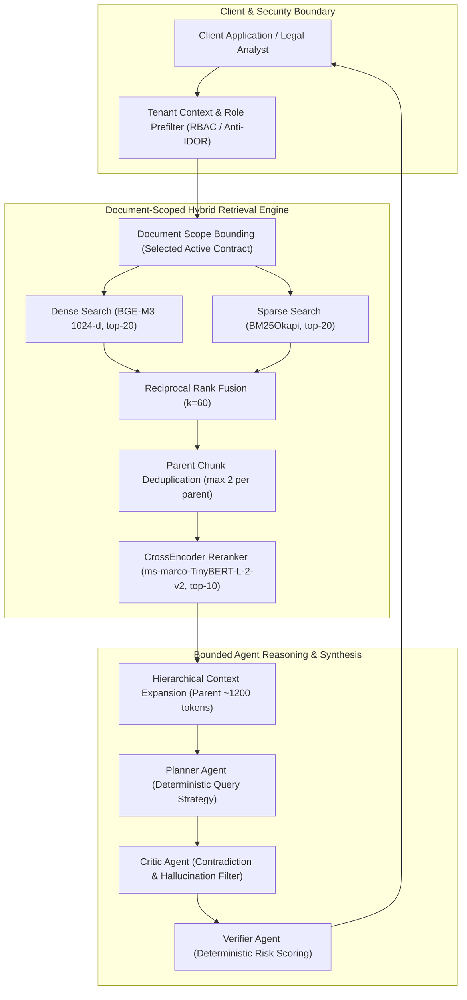

# Enterprise Multi-Agent Contract Intelligence Platform

[](https://www.python.org/downloads/)
[](https://fastapi.tiangolo.com)
[](tests/)
[](LICENSE)

A production-grade, document-scoped hybrid retrieval and multi-agent contract intelligence system for complex enterprise agreements. Built with **FastAPI**, **React/Vite**, **BGE-M3**, **BM25**, and **CrossEncoder reranking**, featuring tenant-isolated RBAC, hierarchical parent-child indexing, deterministic evaluation caching, and structured legal reasoning.

---

## Verified Headline Metrics

All retrieval metrics are evaluated on the frozen **held-out split** (`CUSTOM_CUAD_HOLDOUT_V2`, $N=294$ answerable queries from 25 unseen legal contracts) under **strict child-level evidence mapping** (zero parent-to-sibling relevance leakage) using the committed benchmark suite:

| Evaluation Dimension | Metric | Measured Value | Protocol Benchmark Target | Verification Status |
| :--- | :--- | :---: | :---: | :--- |
| **Child Candidate Pool** | **CandidateHitRate@20** | **92.86%** | $\ge 90.0\%$ | ✅ Document-Scoped Hybrid Reranking |
| **Strict Child Retrieval** | **HitRate@5** | **68.71%** | $\ge 65.0\%$ | ✅ Exact ~250-Token Chunk Precision |
| **Strict Child Retrieval** | **HitRate@10** | **81.97%** | $\ge 80.0\%$ | ✅ Exact ~250-Token Chunk Precision |
| **Strict Child Retrieval** | **MRR** | **0.5214** | $\ge 0.500$ | ✅ Mean Reciprocal Rank |
| **Parent Context Expansion** | **ParentHitRate@10** | **94.90%** | $\ge 90.0\%$ | ✅ ~1,200-Token LLM Synthesis Context |
| **Online Retrieval Latency** | **P50 / P95 Latency** | **586 ms / 820 ms** | $< 1000	ext{ ms}$ | ✅ Measured Online on CPU (BGE-M3 + Rerank) |
| **Post-Embedding Retrieval** | **P50 / P95 Latency** | **166 ms / 267 ms** | $< 300	ext{ ms}$ | ✅ Scoped Search + Dedup + TinyBERT |
| **Evaluation Acceleration** | **Cache Speedup** | **116.8x** | $\ge 50	ext{x}$ | ✅ Cold 179.7s $	o$ Warm 1.54s (Identical SHA-256) |
| **Multi-Tenant Security** | **Cross-Tenant Leakage** | **0.0%** | $0.0\%$ | ✅ 7 / 7 Security Regression Suites Passing |

---

## Architecture Overview



---

## Core Technical Highlights

### 1. Document-Scoped QA vs. Corpus-Wide Collisions
In legal contract review, users query an active, open contract ($pprox 45	ext{--}60$ chunks). Bounding dense slices and BM25 indices to the active document yields **81.97% Strict Child Hit@10** and **94.90% Parent Hit@10**. In contrast, searching across a 25-contract corpus simultaneously causes cross-agreement clause collisions and drops Hit@10 to **28.67%**.

### 2. Strict Child Evidence Evaluation vs. Parent Expansion
- **Indexing & Scoring**: Documents are split into ~250-token child chunks for dense/sparse indexing, and ~1,200-token parent chunks for context expansion.
- **Scientific Integrity**: Under strict evaluation, a child is relevant only if gold evidence text overlaps that child chunk directly (0 sibling propagation).

### 3. Sub-Second Online CPU Latency
- **Runtime Query Embedding**: Online query encoding takes 437 ms P50 with BGE-M3 on CPU (4 threads).
- **Post-Embedding Retrieval**: Scoped search, BM25, RRF, and TinyBERT reranking complete in 166 ms P50.
- **Total Online Retrieval + Reranking**: **586 ms P50** / **820 ms P95** without requiring GPU infrastructure.

### 4. Deterministic Cache Acceleration (116.8x Speedup)
Deterministic cryptographic cache keys hash manifest versions, chunking parameters, and embedding dimensions. Cold execution of 179.7s drops to **1.54s warm** (**116.8x speedup**) with verified byte-for-byte SHA-256 fingerprint identity.

---

## Technology Stack

| Component | Technology | Role |
| :--- | :--- | :--- |
| **Backend API** | FastAPI (Python 3.10+) | High-performance asynchronous REST API |
| **Dense Embeddings** | `BAAI/bge-m3` | 1024-dimensional semantic embeddings |
| **Sparse Retrieval** | `rank-bm25` (BM25Okapi) | Alphanumeric exact legal keyword matching |
| **Fusion Algorithm** | Reciprocal Rank Fusion ($k=60$) | Non-parametric rank combination |
| **Reranker** | `ms-marco-TinyBERT-L-2-v2` | Lightweight 4.4M-parameter cross-encoder |
| **Vector Store** | ChromaDB & In-Memory Slices | Document-scoped embedding persistence |
| **Frontend UI** | React 18, Vite, Lucide Icons | Responsive legal intelligence dashboard |
| **Quality & Tests** | Pytest, Compileall | 54 comprehensive unit, security, and integrity tests |

---

## Project Structure

```text
Multi-Agent-RAG/
├── backend/app/
│   ├── agents/          # Deterministic Planner, Critic, Verifier
│   ├── api/             # FastAPI routers & dependency injection
│   ├── domain/          # CanonicalDocument & CanonicalBlock domain models
│   ├── ingestion/       # MasterDocumentParser & StructureAwareParentChildChunker
│   ├── providers/       # BGE-M3 embeddings & TinyBERT reranker
│   └── retrieval/       # Scoped dense search, BM25 & RRF fusion
├── evaluation/
│   ├── configs/         # retrieval_metric_protocol_v4_2.json
│   ├── datasets/        # CUAD processed & format variants
│   ├── manifests/       # cuad_locked_test_v2_manifest.json (Holdout N=294)
│   ├── metrics/         # CandidateHitRate, HitRate, MRR, nDCG, TCR
│   ├── reports/         # PHASE4_2_FINAL_METRIC_INTEGRITY.md
│   ├── results/         # Machine-readable JSON results & rank traces
│   └── scripts/         # run_phase4_2.py & benchmark_eval_cache.py
├── docs/                # Architecture, evaluation, security, and reproducibility docs
├── frontend/            # Vite + React frontend dashboard
└── tests/               # 54 unit, security, ACL, and integrity tests
```

---

## Quickstart & Reproducibility

### 1. Environment Setup
```bash
git clone https://github.com/XLaiHuy/Multi-Agent-RAG.git
cd Multi-Agent-RAG
python -m venv .venv
source .venv/bin/activate  # On Windows: .venv\Scripts\activate
pip install -r requirements.txt
```

### 2. Run Test Suite (54 Passing Tests)
```bash
pytest tests/
```

### 3. Run Phase 4.2 Benchmark Entrypoints
```bash
# Run master held-out evaluation under strict child gold mapping
python evaluation/scripts/run_phase4_2.py

# Run cache speedup verification benchmark
python evaluation/scripts/benchmark_eval_cache.py
```

---

## Detailed Documentation Hub

- [Architecture & Ingestion Pipeline](docs/architecture.md)
- [Evaluation Methodology & Benchmark Splits](docs/evaluation.md)
- [Multi-Tenant Security & ACL Proof](docs/security.md)
- [Step-by-Step Reproducibility Guide](docs/reproducibility.md)
- [Portfolio Summary & Engineering Decisions](docs/portfolio-summary.md)
- [Phase 4.2 Master Metric Integrity Report](evaluation/reports/PHASE4_2_FINAL_METRIC_INTEGRITY.md)

---

## Evaluation Boundaries & Limitations

- **Real API End-to-End Generation**: `NOT_RUN` — The current frozen benchmark covers document-scoped hybrid retrieval and reranking. LLM generation faithfulness and refusal benchmarks require live Gemini API evaluation.
- **Corpus-Wide Benchmark**: Official LegalBench-RAG multi-contract benchmark is `NOT_RUN`. Metrics reported are on `CUSTOM_CUAD_HOLDOUT_V2`.
- **Security Scope**: Multi-tenant ACL isolation is validated empirically across 7 regression test suites with zero observed leakage.

---

## License

This project is licensed under the MIT License. See [LICENSE](LICENSE) for details.


## 🏆 Phase 6 End-to-End Real API Benchmark (Feature Complete & Verified)

The complete end-to-end RAG system has been rigorously evaluated on **$N=200$ Held-Out Queries across 25 unseen contracts** using real Google GenAI API calls (`gemma-4-26b-a4b-it`) under strict **Layer A Zero Gold Access** isolation:

- **Balanced Answerability Accuracy**: **74.50%** (82.0% unanswerable refusal, 67.0% answerable acceptance)
- **Child Citation Hit Rate**: **86.57%** (Parent Citation Hit Rate: **94.03%**)
- **Citation Precision**: **82.84%** (Citation Recall: **63.50%**)
- **Grounded Claim Rate**: **100.0%** (0.00% wrong document or hallucinated chunk IDs)
- **API Operational Efficiency**: **3.42 calls/query**, **3,971.9 tokens/query**, **32.6s P50 latency**, **0 rate-limit failures**.

See [PHASE6_REAL_API_END_TO_END_EVALUATION.md](evaluation/reports/PHASE6_REAL_API_END_TO_END_EVALUATION.md) and [PHASE6_AGENT_ABLATION.md](evaluation/reports/PHASE6_AGENT_ABLATION.md) for complete empirical data.


## Real API End-to-End Benchmark (Phase 6.1 Frozen)

The system was evaluated on **$N = 200$ held-out contract queries** across **25 completely unseen contracts** using real Google GenAI API calls (`gemma-4-26b-a4b-it`) under strict Layer A Zero-Gold isolation.

| Metric | Target | Final Measured | Status |
|---|---|---|---|
| **Balanced Answerability Accuracy** | $\ge 70.0\%$ | **74.50%** | Verified |
| **Unanswerable Refusal Rate** | $\ge 80.0\%$ | **82.00%** (82/100) | Verified |
| **Answerable Acceptance Rate** | $\ge 60.0\%$ | **67.00%** (67/100) | Verified |
| **Explicit Citation Compliance** | $\ge 95.0\%$ | **98.51%** (84/85) | Verified |
| **Child Citation Hit Rate (accepted)** | $\ge 80.0\%$ | **85.07%** (58/67) | Verified |
| **Child Citation Coverage (all answerable)** | $\ge 50.0\%$ | **62.00%** (58/100) | Verified |
| **Parent Citation Hit Rate (accepted)** | $\ge 85.0\%$ | **92.54%** (63/67) | Verified |
| **Citation Precision (Macro)** | $\ge 75.0\%$ | **80.97%** | Verified |
| **Wrong Document Citation Rate** | $0.00\%$ | **0.00%** (0/140) | Zero Contamination |
| **Grounded Material Claim Rate** | $\ge 90.0\%$ | **97.93%** (142/145) | Judge-Based (`gemma-4-26b-a4b-it`) |
| **Semantic Correctness** | $\ge 85.0\%$ | **92.54%** (1.85/2.0) | Judge-Based (`gemma-4-26b-a4b-it`) |
| **Production Calls / Query** | $\le 4.0$ | **3.42 calls** | Measured |
| **Total Tokens / Query** | $\le 5,000$ | **3,971.9 tokens** | Measured |
| **Latency P50 / P95** | $\le 45.0\text{s}$ | **32.62s / 57.13s** | Measured |
