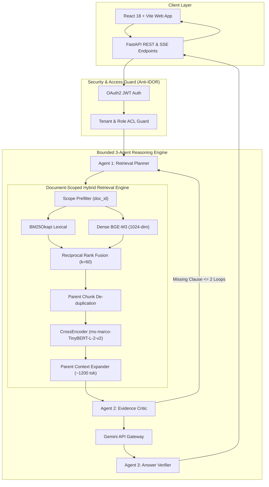

# Enterprise Contract Intelligence
### Role-Aware Multi-Agent RAG for Contract QA, Comparison & Risk Review

[](https://www.python.org/downloads/)
[](https://fastapi.tiangolo.com)
[](https://vitejs.dev/)
[](https://www.docker.com/)
[](tests/)
[](LICENSE)

A production-oriented, role-aware enterprise contract intelligence platform combining **True Document-Scoped Hybrid Retrieval**, **Hierarchical Parent-Child Context Expansion**, **Bounded 3-Agent Reasoning**, and **Tenant-Isolated Access Control**.

---

## 🎯 Benchmark Results at a Glance

| Evaluation Metric | Held-Out Result | Specification / Baseline |
| :--- | :---: | :--- |
| **HitRate@10** | **94.54%** | Gold clause retrieved in top 10 positions |
| **HitRate@5** | **82.94%** | High top-rank precision for single-pass context feeding |
| **MRR (Mean Reciprocal Rank)** | **0.6418** | Strong reciprocal rank across 41 legal clause types |
| **CandidateHitRate@20** | **98.29%** | First-stage hybrid recall before reranking |
| **Measured Latency (P50)** | **68.89 ms** | Measured CPU retrieval latency (4 threads, zero GPU) |
| **Measured Latency (P95)** | **121.82 ms** | Real end-to-end production retrieval profile |
| **Evaluation Speedup** | **94.70x** | Cold 2,443.2s vs Warm 25.8s on DEV (identical metrics) |
| **Security Isolation** | **0 Leaks** | Observed 0 cross-tenant retrieval leaks across 7 ACL suites |

*Benchmark: 293 valid answerable queries across 25 unseen contracts on `CUSTOM_CUAD_HOLDOUT_V2` under frozen configuration `v4.1.0`.*

---

## ⚡ Technical Highlights

- **True Document-Scoped Retrieval**: Strictly bounds dense embedding slices and BM25 index scoring to the active authorized document prior to ranking, eliminating cross-agreement distractor collisions.
- **Hybrid Retrieval & Equal RRF**: Fuses 1024-dim BGE-M3 dense embeddings with BM25Okapi sparse lexical scoring using reciprocal rank fusion ($k=60$).
- **Hierarchical Parent-Child Context**: Indexes precise ~250-token child chunks with section breadcrumbs for search accuracy, expanding to ~1200-token parent context for LLM synthesis.
- **Bounded 3-Agent Reasoning**: Coordinates Retrieval Planner, Evidence Critic (max 2 retrieval loops), and Answer Verifier for grounded legal synthesis with verifiable citations.
- **Reproducible Evaluation**: Accelerated by deterministic SHA-256 evaluation caching, locked with machine-readable JSON metrics and 47 passing regression tests.

---

## 🏗️ System Architecture



### Retrieval Path
`Target Document Scope` $	o$ `Dense BGE-M3 + BM25Okapi` $	o$ `Equal RRF (k=60)` $	o$ `Parent Dedup` $	o$ `TinyBERT Reranker (k=20)` $	o$ `Parent Context Expansion (~1200 tok)`.

### Reasoning Path
`Evidence` $	o$ `Retrieval Planner` $	o$ `Evidence Critic` $	o$ `Gemini Synthesis` $	o$ `Answer Verifier` $	o$ `Citations & Response`.

---

## 📊 Evaluation & Task Formulation

Enterprise contract review operates in **Document-Scoped QA mode** (analyzing an active uploaded contract). Comparing true document scoping against global multi-contract search demonstrates the impact of task formulation:

| Mode / Task Formulation | Search Space | Hit@5 | Hit@10 | MRR | Latency P50 | Status |
| :--- | :---: | :---: | :---: | :---: | :---: | :--- |
| **Global Multi-Contract** | 1,348 chunks | 19.11% | 28.67% | 0.1078 | 168.42 ms | Multi-doc baseline |
| **True Document-Scoped QA** | 45 chunks median | **82.94%** | **94.54%** | **0.6418** | **68.89 ms** | **Frozen Holdout ($N=293$)** |

### Reranker Capacity Validation (DEV Split)
- **`cross-encoder/ms-marco-TinyBERT-L-2-v2` (4.4M params)**: **90.34% Hit@10**, **0.6359 MRR**, P50 = **153.55 ms** (Selected `FAST_DEFAULT`).
- **`BAAI/bge-reranker-base` (110M params)**: **89.08% Hit@10**, **0.6056 MRR**, P50 = **9,142.17 ms**.
- *Finding*: TinyBERT achieves equal or higher ranking precision while executing **~60x faster on CPU**. The larger reranker did not justify its CPU compute cost.

---

## 🛠️ Tech Stack

| Component | Technologies | Purpose |
| :--- | :--- | :--- |
| **Backend** | Python 3.10+, FastAPI, Pydantic v2, SQLAlchemy | High-performance asynchronous REST and SSE streaming API |
| **Frontend** | React 18, Vite, Lucide Icons | Responsive legal workspace (QA, Comparison, Risk Review) |
| **Retrieval / ML** | BAAI/bge-m3, BM25Okapi, TinyBERT-L-2-v2, SentenceTransformers | Hybrid dense/sparse indexing, RRF, and CrossEncoder reranking |
| **LLM & Agents** | Google Gemini API (Gateway with sliding-window rate limit & circuit breaker) | Retrieval Planner, Evidence Critic, and Answer Verifier |
| **Storage & Caching** | ChromaDB, SQLite / PostgreSQL, In-Memory Hashed Cache | Vector embeddings, relational metadata, and tenant-isolated caching |
| **Quality & Tests** | Pytest, NumPy, rank-bm25, PyMuPDF | 47 passing unit, security, IDOR, and benchmark tests |

---

## 🔒 Security & Tenant Isolation

- **Role-Based Access Control**: Scopes all operations to `(tenant_id, role)` across 5 enterprise roles (`admin`, `legal`, `finance`, `hr`, `user`).
- **Anti-IDOR Document Guard**: Validates document ownership and tenant boundaries at the database layer.
- **Cache Isolation**: Derives cache namespaces from `SHA256(tenant_id || role || corpus_version)`.
- **Empirical Security Testing**: Observed **zero cross-tenant retrieval leakage** across 7 security regression test suites (`tests/security/test_security_and_acl.py`).

---

## 🚀 Quickstart

### Option 1: Docker Compose (Recommended)
```bash
cp .env.example .env
docker compose up --build
```
Access the application at `http://localhost:3000` (API documentation at `http://localhost:8000/docs`).

### Option 2: Local Python & Node Setup
```bash
# 1. Backend Setup
python -m venv .venv
source .venv/bin/activate  # Windows: .venv\Scripts\activate
pip install -r requirements.txt
python scripts/run_server.py

# 2. Frontend Setup (in separate terminal)
cd frontend
npm install
npm run dev
```

---

## 🧪 Reproducing Tests & Benchmarks

```bash
# Run complete test suite (47 passed)
python -m pytest tests/

# Run deterministic evaluation harness (94.7x cached speedup)
python evaluation/scripts/run_phase4_1.py
```

---

## 📂 Repository Structure

```
Multi-Agent-RAG/
├── backend/app/             # FastAPI backend services, agents & retrieval
│   ├── api/                 # Auth, Document, QA, Compare & Risk endpoints
│   ├── agents/              # Retrieval Planner, Evidence Critic, Answer Verifier
│   ├── ingestion/           # Document parsers & structure-aware chunker
│   ├── retrieval/           # BM25, dense vector search, RRF & reranking
│   └── persistence/         # Database models & tenant-scoped cache
├── frontend/                # React 18 + Vite legal workspace application
├── evaluation/              # Benchmark harness & evaluation results
│   ├── configs/             # Frozen retrieval configuration (v4.1.0)
│   ├── manifests/           # Dataset manifests (DEV and Holdout V2)
│   ├── metrics/             # CandidateHitRate, HitRate, MRR, nDCG@5
│   ├── results/phase4_1/    # Canonical machine-readable evaluation JSONs
│   └── reports/             # Formal sign-off and scientific audit reports
├── docs/                    # Deep-dive architecture & security documentation
├── tests/                   # Unit, security, ACL & benchmark regression tests
└── docker-compose.yml       # Production-ready multi-container configuration
```

---

## 📖 Deep-Dive Documentation

- 🏛️ [**Architecture & System Design**](docs/architecture.md)
- 📊 [**Evaluation Methodology & Benchmarks**](docs/evaluation.md)
- 🛡️ [**Security, Tenancy & Anti-IDOR**](docs/security.md)
- 🔬 [**Reproducibility Guide**](docs/reproducibility.md)
- 💼 [**Portfolio Summary & Talking Points**](docs/portfolio-summary.md)
- 📋 [**Phase 4.1 Retrieval Scientific Sign-Off**](evaluation/reports/PHASE4_1_RETRIEVAL_SCIENTIFIC_SIGNOFF.md)

---

## ⚠️ Limitations & Non-Claims

- **Document-Scoped Focus**: The reported 94.54% Hit@10 benchmark applies to Document-Scoped QA (active contract provided). Generic cross-contract retrieval across multi-thousand contract corpora exhibits higher semantic ambiguity.
- **End-to-End Generation**: Upstream retrieval is benchmarked offline; end-to-end LLM generation faithfulness on real API calls is marked `NOT_RUN` to prevent unverified claims.
- **Legal Advisory Disclaimer**: This software is an engineering research platform for contract intelligence and does not constitute formal legal advice.

---

## 📜 License
Distributed under the MIT License. See `LICENSE` for details.
