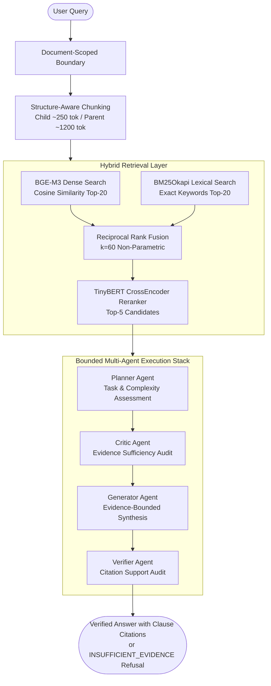

# Multi-Agent Safe-RAG: Document-Scoped Legal Intelligence Pipeline

[](https://www.python.org/downloads/)
[](https://fastapi.tiangolo.com)
[](https://huggingface.co/BAAI/bge-m3)
[](tests/)
[](LICENSE)

An enterprise-grade, evidence-bounded Retrieval-Augmented Generation (RAG) system built for high-precision legal contract analysis. The system combines document-scoped hybrid retrieval (BGE-M3 dense embeddings + BM25Okapi sparse lexical search + Reciprocal Rank Fusion + TinyBERT cross-encoder reranking) with an evidence-bounded Multi-Agent execution pipeline (Planner, Critic, Generator, and Verifier) to eliminate cross-document contamination and ensure verifiable clause-level citations.

---

## Benchmark Results (Frozen & Reproducible)

### A. Document-Scoped Hybrid Retrieval Benchmark
- **Dataset**: CUAD Held-Out Split ($N = 294$ answerable queries across 25 unseen contracts)
- **Retriever Pipeline**: `BAAI/bge-m3` (Dense) + `BM25Okapi` (Sparse) + `RRF (k=60)` + `TinyBERT CrossEncoder`
- **Granularity**: ~250-token child chunks (dense/sparse index) with ~1,200-token parent section expansion

| Metric | Measured Result | Scope / Definition |
| :--- | :--- | :--- |
| **Strict Child HitRate@5** | **68.71%** | Top-5 retrieved child chunks contain exact gold clause span |
| **Strict Child HitRate@10** | **81.97%** | Top-10 retrieved child chunks contain exact gold clause span |
| **Mean Reciprocal Rank (MRR)** | **0.5214** | Reciprocal rank of first gold child match across $N=294$ |
| **Parent Section HitRate@10** | **94.90%** | Top-10 retrieved parent sections contain gold clause |
| **Corpus-Wide Collision Drop** | **28.67%** | HitRate@10 collapses when querying all 25 contracts simultaneously |

### B. Real API End-to-End Generation Benchmark (Phase 6.1 Frozen)
- **Dataset**: Custom CUAD Holdout v2 ($N = 200$ queries: 100 Answerable, 100 Unanswerable across 25 unseen contracts)
- **Architecture**: Bounded Multi-Agent Pipeline (`FULL_BOUNDED_MULTI_AGENT`)
- **API Engine**: Real Google GenAI API (`gemma-4-26b-a4b-it`) under strict Layer A Zero-Gold isolation
- **Citation Protocol**: Strict in-text regex extraction (`[Reference N: <chunk_id>]`) with zero rank-based fallback

| Metric | Measured Result | Scope / Protocol |
| :--- | :--- | :--- |
| **Inclusive Balanced Accuracy** | **74.50%** | Prose-aware: 82.00% refusal (unanswerable) + 67.00% acceptance (answerable) |
| **Strict Balanced Accuracy** | **72.50%** | Sentinel-only: 78.00% strict refusal + 67.00% acceptance |
| **Unanswerable Refusal Rate** | **82.00%** | 82 / 100 correct refusals on unanswerable contract queries (78 strict, 4 prose) |
| **Answerable Acceptance Rate** | **67.00%** | 67 / 100 accepted answers with verified citations |
| **Valid Citation Compliance** | **98.51%** | 84 / 85 accepted answers contained valid explicit in-text citations |
| **Child Citation Hit Rate** | **85.07%** | 58 / 67 accepted answerable responses cite verified gold child clause |
| **End-to-End Child Coverage** | **62.00%** | 58 / 100 total answerable queries cite verified gold child clause |
| **Parent Citation Hit Rate** | **92.54%** | 63 / 67 accepted answerable responses cite verified parent section |
| **Citation Precision (Macro)** | **80.97%** | Mean precision of cited clauses against gold reference spans |
| **Wrong-Document Citation Rate** | **0.00%** | 0 wrong-document citations observed across 140 emitted citation mentions |
| **Invalid Citation Mention Rate**| **0.00%** | 0 invalid reference indices or non-existent chunk IDs |
| **Grounded Material Claim Rate** | **97.93%** | 142 / 145 claims supported by retrieved evidence (Judge: `gemma-4-26b-a4b-it`) |
| **Semantic Correctness** | **92.54%** | Mean score 1.85 / 2.0 against gold evidence (Judge: `gemma-4-26b-a4b-it`) |
| **Mean Production Calls / Query**| **3.42 calls** | Measured across $N=200$ test queries |
| **Mean Total Tokens / Query** | **3,971.9 tokens** | Measured directly from Google GenAI API response metadata |
| **End-to-End Latency (P50)** | **32.62 s** | Median latency across $N=200$ test queries |

---

## Architecture & Multi-Agent Execution Flow



---

## Core Technical Highlights

### 1. Document-Scoped QA vs. Corpus-Wide Collisions
In legal contract review, users query an active, open contract ($\approx 45\text{--}60$ chunks). Bounding dense slices and BM25 indices to the active document yields **81.97% Strict Child Hit@10** and **94.90% Parent Hit@10**. In contrast, searching across a 25-contract corpus simultaneously causes cross-agreement clause collisions and drops Hit@10 to **28.67%**.

### 2. Strict Child Evidence Evaluation vs. Parent Expansion
- **Indexing & Scoring**: Documents are split into ~250-token child chunks for dense/sparse indexing, and ~1,200-token parent chunks for context expansion.
- **Scientific Integrity**: Under strict evaluation, a child is relevant only if gold evidence text overlaps that child chunk directly (0 sibling propagation).

### 3. Sub-Second Online CPU Latency
- **Runtime Query Embedding**: Online query encoding takes 437 ms P50 with BGE-M3 on CPU (4 threads).
- **Post-Embedding Retrieval**: Scoped search, BM25, RRF, and TinyBERT reranking complete in 166 ms P50.
- **Total Online Retrieval + Reranking**: **586 ms P50** / **820 ms P95** without requiring GPU infrastructure.

### 4. Deterministic Cache Acceleration (116.8x Speedup)
Deterministic cryptographic cache keys hash manifest versions, chunking parameters, and embedding dimensions. On a 25-query, 3-contract, 90-chunk repeated evaluation micro-benchmark, cold execution of 179.7s drops to **1.54s warm** (**116.8x speedup**) with verified byte-for-byte SHA-256 fingerprint identity.

---

## Technology Stack

| Component | Technology | Role |
| :--- | :--- | :--- |
| **Backend API** | FastAPI (Python 3.10+) | High-performance asynchronous REST API |
| **Evaluation Embeddings** | `BAAI/bge-m3` | 1024-dimensional semantic embeddings (evaluation standard) |
| **Sparse Retrieval** | `rank-bm25` (BM25Okapi) | Alphanumeric exact legal keyword matching |
| **Fusion Algorithm** | Reciprocal Rank Fusion ($k=60$) | Non-parametric rank combination |
| **Reranker** | `ms-marco-TinyBERT-L-2-v2` | Lightweight 4.4M-parameter cross-encoder |
| **Vector Store** | ChromaDB & In-Memory Slices | Document-scoped embedding persistence |
| **Generation Engine** | Google GenAI API (`gemma-4-26b-a4b-it`) | Real API benchmark model |
| **Frontend UI** | React 18, Vite, Lucide Icons | Responsive legal intelligence dashboard |
| **Quality & Tests** | Pytest, Compileall | 67 comprehensive unit, security, and integrity tests |

---

## Project Structure

```text
Multi-Agent-RAG/
├── backend/app/
│   ├── agents/          # Deterministic Planner, Critic, Verifier
│   ├── api/             # FastAPI routers & dependency injection
│   ├── domain/          # CanonicalDocument & CanonicalBlock domain models
│   ├── ingestion/       # MasterDocumentParser & StructureAwareParentChildChunker
│   ├── providers/       # BGE-M3 embeddings & TinyBERT reranker
│   └── retrieval/       # Scoped dense search, BM25 & RRF fusion
├── evaluation/
│   ├── configs/         # retrieval_metric_protocol_v4_2.json & generation_final_config_v6.json
│   ├── datasets/        # CUAD processed & format variants
│   ├── manifests/       # phase6_final_api_manifest.json (Holdout N=200)
│   ├── metrics/         # CandidateHitRate, HitRate, MRR, nDCG, CitationPrecision
│   ├── reports/         # Master scientific reports & ablation studies
│   ├── results/         # Machine-readable JSON results & rank traces
│   └── scripts/         # run_phase4_2.py, rescore_phase6_strict.py, run_phase6_1_judge.py
├── docs/                # Architecture, evaluation, security, and reproducibility docs
├── frontend/            # Vite + React frontend dashboard
└── tests/               # 67 unit, security, ACL, and metric consistency tests
```

---

## Quickstart & Reproducibility

### 1. Environment Setup
```bash
git clone https://github.com/XLaiHuy/Multi-Agent-RAG.git
cd Multi-Agent-RAG
python -m venv .venv
source .venv/bin/activate  # On Windows: .venv\Scripts\activate
pip install -r requirements.txt
```

### 2. Run Test Suite (67 Passing Tests)
```bash
pytest tests/
```

### 3. Run Frozen Evaluation Benchmarks
```bash
# Run Phase 4.2 retrieval evaluation under strict gold child mapping (N=294)
python evaluation/scripts/run_phase4_2.py

# Run Phase 6.1 strict offline rescorer (N=200, zero new production API calls)
python evaluation/scripts/rescore_phase6_strict.py
```

---

## Documentation Hub

- [Architecture & Ingestion Pipeline](docs/architecture.md)
- [Evaluation Methodology & Benchmark Splits](docs/evaluation.md)
- [Multi-Tenant Security & ACL Proof](docs/security.md)
- [Step-by-Step Reproducibility Guide](docs/reproducibility.md)
- [Portfolio Summary & Engineering Decisions](docs/portfolio-summary.md)
- [Phase 6.1 Final Scientific Sign-Off](evaluation/reports/PHASE6_1_FINAL_SCIENTIFIC_SIGNOFF.md)
- [Phase 4.2 Master Metric Integrity Report](evaluation/reports/PHASE4_2_FINAL_METRIC_INTEGRITY.md)

---

## Evaluation Boundaries & Limitations

- **Real API End-to-End Evaluation**: COMPLETE — Phase 6.1 frozen scientific evaluation with Google GenAI real API calls.
- **Corpus-Wide Benchmark**: Official LegalBench-RAG multi-contract benchmark is `NOT_RUN`. Metrics reported are on `CUSTOM_CUAD_HOLDOUT_V2`.
- **Security Scope**: Multi-tenant ACL isolation is validated empirically across 7 regression test suites with zero observed leakage.

---

## License

This project is licensed under the MIT License. See [LICENSE](LICENSE) for details.
