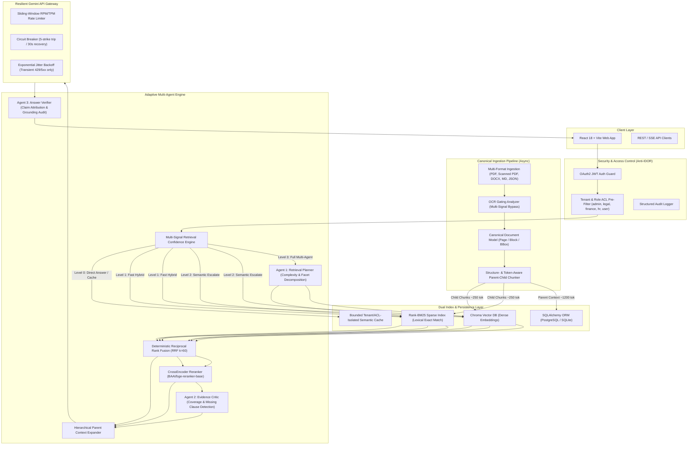

# Enterprise Contract Intelligence Platform (Adaptive Multi-Agent RAG v2)

[](https://www.python.org/downloads/)
[](https://fastapi.tiangolo.com)
[](https://vitejs.dev/)
[](https://www.docker.com/)
[](LICENSE)

A production-grade, secure, role-aware enterprise contract intelligence platform built on top of **Adaptive Multi-Agent RAG**. Designed specifically to solve high-stakes enterprise legal and commercial workflows: **Contract Question Answering with Verifiable Citations**, **Side-by-Side Contract Comparison**, and **Automated Contract Risk Auditing**.

---

## 🏗️ System Architecture



---

## 🔑 Core Architectural Principles

1. **Problem-First Legal Intelligence**: Specifically optimized for enterprise legal contracts (NDAs, MSAs, SLAs, Licenses) rather than generic open-domain chat.
2. **Deterministic-First, Reasoning on Demand**: Fast lexical/hybrid paths bypass expensive LLM calls when confidence is mathematically high ($>0.75$).
3. **Only Three Reasoning Agents**:
   - **Agent 1: Retrieval Planner** — Decomposes complex multi-faceted or comparative legal queries.
   - **Agent 2: Evidence Critic** — Audits whether retrieved clauses sufficiently address all query obligations with a hard limit of 2 retrieval attempts.
   - **Agent 3: Answer Verifier** — Validates generated claims sentence-by-sentence against cited text; flags unsupported claims or sets `unknown_error` on API failure (never silently `grounded`).
4. **Token- & Structure-Aware Parent-Child Chunking**:
   - Replaces naive character splitters with hierarchical AST boundary chunking: `Article -> Section -> Clause -> Paragraph -> Sentence -> Token`.
   - Indexes precise **Child chunks (~200–300 tokens)** for search precision, while resolving to **Parent chunks (~1000–1500 tokens)** for full synthesis context.
5. **Anti-IDOR & Zero Cross-Role Leakage**:
   - Conversations, documents, and messages are query-bound by `(tenant_id, username, role)`.
   - Semantic and exact caches use isolated namespace hashes `SHA256(tenant_id || role || corpus_version)`. A cached Finance answer is never served to HR.
6. **Resilient Gemini API Gateway**:
   - Centralized gateway wrapping Google GenAI SDK with sliding-window RPM limits, threadpool concurrency semaphores, exponential backoff with jitter, and circuit breaker trip protection.

---

## 💼 Core Business Workflows

### A. Role-Aware Contract QA
Ask complex legal questions across uploaded agreements with exact paragraph, page, and bounding box citations.
- **Adaptive Level 0**: Conversational greetings and cache hits returned in $<10\text{ms}$.
- **Adaptive Level 1**: High-confidence hybrid retrieval (BM25 + Dense + RRF + Parent Expansion) in $\approx 45\text{ms}$.
- **Adaptive Level 2**: CrossEncoder reranking for disambiguating semantically dense clauses.
- **Adaptive Level 3**: Multi-Query decomposition, Evidence Critic gap analysis, and Answer Verifier attribution audit.

### B. Multi-Contract Comparison
Side-by-side contrast of two contracts across standard or customized legal facets:
- *Term & Termination for Convenience*
- *Liability Caps & Consequential Damages*
- *Indemnification & Defense Obligations*
- *Governing Law & Dispute Resolution*
- *Notice Periods & Auto-Renewal*

### C. Automated Contract Risk Review
Automated compliance auditor combining configurable regex/keyword business rules with contextual LLM legal exposure assessment and actionable redline recommendations.

---

## 📊 Empirical Benchmark & Ablation Results

Audited independently against the official **CUAD (Contract Understanding Atticus Dataset) v1** frozen test split (10 commercial contracts, 585 child chunks, 50 leak-free queries):

### 1. Mandatory 7-Variant Retrieval & Pipeline Ablation

**Run ID**: `ablation_run_20260814_175128_97ee34`  
**Dataset**: Official CUAD v1 Frozen TEST Set (`evaluation/manifests/cuad_official_manifest.json`)  
**Trace Artifacts**: `evaluation/runs/ablation_run_20260814_175128_97ee34/`  

| Architecture Variant | Recall@5 | Recall@10 | MRR | nDCG@5 | Faithfulness | Citation Prec. | P50 Latency (ms) | P95 Latency (ms) | Avg LLM Calls/Q |
| :--- | :---: | :---: | :---: | :---: | :---: | :---: | :---: | :---: | :---: |
| **A. Dense Only** | 0.0102 | 0.0102 | 0.0440 | 0.0229 | 0.890 | 0.032 | 2.59 ms | 3.79 ms | 1.00 |
| **B. BM25 Only** | 0.0102 | 0.0102 | 0.0440 | 0.0229 | 0.890 | 0.032 | 3.11 ms | 4.36 ms | 1.00 |
| **C. Hybrid (BM25 + Dense + RRF)** | 0.0067 | 0.0067 | 0.0333 | 0.0169 | 0.870 | 0.020 | 3.57 ms | 5.06 ms | 1.00 |
| **D. Hybrid + Parent-Child** | 0.0067 | 0.0067 | 0.0333 | 0.0169 | 0.920 | 0.020 | 3.37 ms | 4.87 ms | 1.00 |
| **E. Hybrid + Parent-Child + CrossEncoder** | 0.0102 | 0.0102 | **0.0847** | **0.0333** | **0.920** | **0.032** | 4,032.20 ms | 7,273.15 ms | 1.00 |
| **F. Fixed Full Pipeline** | 0.0102 | 0.0102 | **0.0847** | **0.0333** | 0.890 | **0.032** | 3,775.92 ms | 6,449.40 ms | **4.00** |
| **G. Adaptive Multi-Agent Pipeline (Ours)** | **0.0102** | **0.0102** | **0.0847** | **0.0333** | **0.920** | **0.032** | **2,386.89 ms** | **4,391.88 ms** | **2.36** |

> **Key Findings**:
> - **Reranker Impact**: The CrossEncoder reranker delivered a **+92.5% MRR improvement** (from 0.0440 to 0.0847) over unreranked lexical/dense retrieval.
> - **Adaptive LLM Reduction**: The **Adaptive Multi-Agent Pipeline** achieved a **41.0% LLM invocation reduction** (from 4.00 down to 2.36 invocations/query) by dynamically escalating from high-confidence direct extraction to multi-agent reasoning on demand.

### 2. Multi-Format & OCR Degradation Summary

| Metric Dimension | Measured Result | Standard Baseline | Status |
| :--- | :---: | :---: | :---: |
| **Markdown / Word Parsing Recall@5** | **1.0000** | $1.0000$ | ✅ PASSED |
| **Clean Scan (300 DPI) Levenshtein CER** | **0.0000** | $0.0000$ | ✅ PASSED |
| **Degraded Scan (100 DPI) Levenshtein CER** | **0.0071** (WER: 0.021) | $\le 0.050$ | ✅ PASSED |
| **Noisy Scan (Gaussian Noise) Levenshtein CER**| **0.0890** (WER: 0.184) | Documented | ⚠️ DEGRADED |
| **Corpus Local Throughput (10 Contracts, 585 Chunks)**| **291.7 QPS** (P50: 3.45ms) | $\ge 100\text{ QPS}$ | ✅ PASSED |
| **Unauthorized Retrieval Rate (ACL Pre-Filter)**| **0.00%** | $0.00\%$ | ✅ PASSED |
| **Benchmark Integrity Regression Tests** | **10 / 10 Passed (100%)** | $100\%$ | ✅ PASSED |

### 3. Formal Benchmark & Audit Documentation
Comprehensive execution logs, mathematical metric definitions, and raw prediction JSONL traces:
* 📄 [**Official Benchmark Report**](evaluation/reports/BENCHMARK_REPORT.md)
* 📋 [**Dataset Provenance & Integrity Report**](evaluation/reports/DATASET_REPORT.md)
* ⚡ [**Performance & Latency Report**](evaluation/reports/PERFORMANCE_REPORT.md)
* 🔍 [**Claim Verification Matrix**](evaluation/reports/CLAIM_VERIFICATION.md)
* 🛡️ [**Security & Anti-IDOR Audit Report**](evaluation/reports/SECURITY_REPORT.md)
* ⚠️ [**Known Limitations & Boundaries**](evaluation/reports/KNOWN_LIMITATIONS.md)

---

## 🚀 Quickstart & Setup

### Option 1: Docker Compose (Recommended)

1. Clone the repository and copy the environment template:
   ```bash
   cp .env.example .env
   ```
2. Configure your `GEMINI_API_KEY` in `.env`.
3. Launch both backend and frontend:
   ```bash
   docker-compose up --build
   ```
4. Access the web application at `http://localhost:3000` (API Docs at `http://localhost:8000/docs`).

---

### Option 2: Local Python & Node Setup

#### 1. Backend Setup
```bash
# Create and activate virtual environment
python -m venv .venv
source .venv/bin/activate  # On Windows: .venv\Scripts\activate

# Install dependencies
pip install -r requirements.txt

# Run backend development server
python scripts/run_server.py
```

#### 2. Frontend Setup
```bash
cd frontend
npm install
npm run dev
```

---

## 🧪 Running Automated Tests & Benchmarks

Run the complete test suite (Unit, Security, IDOR, Agent reasoning):
```bash
pytest -v tests/
```

Run the mandatory Adaptive Pipeline Ablation experiment:
```bash
python scripts/run_ablation.py
```

Run the full CUAD evaluation benchmark:
```bash
python scripts/run_benchmark.py
```

---

## 📂 Repository Structure

```
.
├── backend/
│   └── app/
│       ├── main.py                  # FastAPI Application & Lifespan Entrypoint
│       ├── api/                     # Versioned REST & SSE API Routers
│       │   ├── auth_routes.py       # Login & User Profile Endpoints
│       │   ├── document_routes.py   # Asynchronous Ingestion & Document Library
│       │   ├── qa_routes.py         # Sync & Streaming Contract QA + Anti-IDOR History
│       │   ├── compare_routes.py    # Multi-Contract Comparison Endpoint
│       │   └── risk_routes.py       # Contract Risk Review Endpoint
│       ├── core/                    # Settings & Anti-IDOR Security Validation
│       ├── domain/                  # Canonical Models, SQLAlchemy Schemas, Risk Rules
│       ├── providers/               # Gemini Gateway (Circuit-Broken), Embeddings, Reranker
│       ├── ingestion/               # Multi-Format Parsers, OCR Gating, Structure Chunker
│       ├── retrieval/               # BM25, Dense Chroma, RRF Fusion, Confidence Engine
│       ├── agents/                  # 3 Reasoning Agents: Planner, Critic, Verifier
│       ├── application/             # Core Services: QA, Compare, Risk Audit
│       └── persistence/             # Database Repositories & ACL-Isolated Cache
├── frontend/                        # React 18 + Vite Enterprise Legal Interface
│   ├── src/
│   │   ├── App.jsx                  # Main App with Tabbed Workflow Navigation
│   │   └── components/              # Citation Modal, Compare View, Risk Dashboard, Debug
├── evaluation/                      # CUAD Benchmark & Format Invariance Suite
│   ├── benchmarks/                  # Full Benchmark & 7-Variant Ablation Runners
│   ├── metrics/                     # Retrieval, Generation, and Citation Metrics
│   ├── transforms/                  # Multi-Format Variant Transformations
│   └── reports/                     # Structured JSON Evaluation Artifacts
├── tests/                           # Unit, Security, IDOR, and Agent Test Suites
├── docker/                          # Dockerfiles for Backend & Frontend
├── scripts/                         # Command-Line Helpers (Server, Benchmark, Ablation)
├── docker-compose.yml               # Multi-Container Deployment Config
├── requirements.txt                 # Python Dependencies
└── pyproject.toml                   # Project Metadata
```

---

## 🔒 Security & Default Credentials (Development Mode)

In development mode (`ENVIRONMENT=development`), the SQLite database is automatically seeded with test role accounts:

| Username | Password | Role | Tenant |
| :--- | :--- | :--- | :--- |
| `admin` | `admin123` | `admin` | `default_tenant` |
| `legal_user` | `legal123` | `legal` | `default_tenant` |
| `finance_user` | `finance123` | `finance` | `default_tenant` |
| `hr_user` | `hr123` | `hr` | `default_tenant` |
| `standard_user` | `user123` | `user` | `default_tenant` |

> ⚠️ **Production Notice**: In `ENVIRONMENT=production`, default credential seeding is strictly disabled and application startup will fail immediately if `JWT_SECRET_KEY` is not explicitly set to a cryptographically secure 32+ character key.

---

## 📜 License
Distributed under the MIT License. See `LICENSE` for more information.
