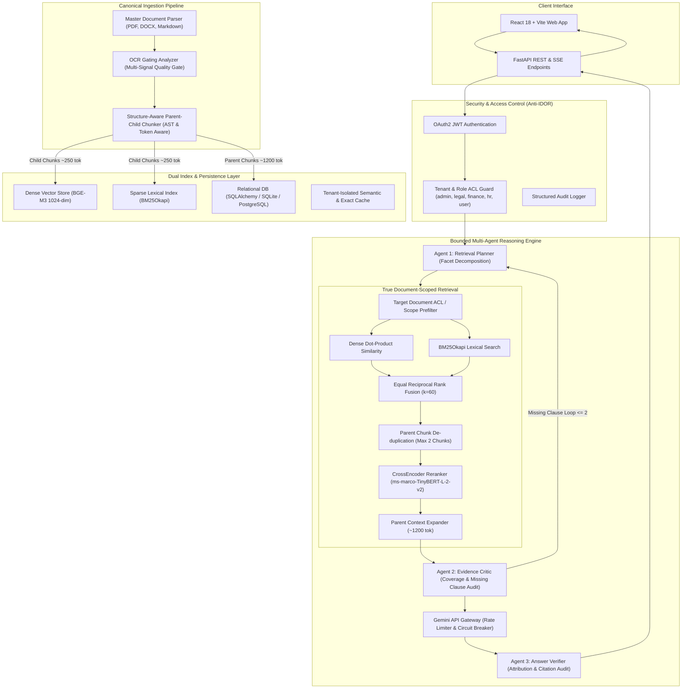

# System Architecture & Technical Specifications

This document details the architectural design, ingestion workflows, dual-index storage, retrieval pipelines, bounded multi-agent reasoning, and security boundaries of the **Enterprise Contract Intelligence Platform**.

---

## 1. System Overview & Boundaries



---

## 2. Ingestion & Chunking Pipeline

Standard text splitters fragment legal clauses across arbitrary character boundaries, destroying cross-references and legal conditions. The ingestion engine implements **Token- & Structure-Aware Hierarchical Chunking**:

1. **Document Parsing**: `MasterDocumentParser` extracts structured text, headings, list structures, and tables across PDF, DOCX, and Markdown formats.
2. **OCR Gating**: Checks image DPI and text extraction density; degraded scans are routed to vision OCR, while digital PDFs bypass OCR with zero quality loss.
3. **Parent-Child Chunking**:
   - **Child Chunks (~200–300 tokens, 30-token overlap)**: Tagged with structural breadcrumbs (`[Document: ...] [Section: ...]`) to maximize dense vector and sparse lexical retrieval precision.
   - **Parent Chunks (~1,000–1,500 tokens, 100-token overlap)**: Preserves complete contractual provisions (e.g., entire Indemnification section with all sub-clauses) in relational storage for synthesis.

---

## 3. True Document-Scoped Retrieval Mechanics

In enterprise contract review, users ask questions about an active selected contract. Searching a global multi-contract corpus creates massive distractor collisions.

```
+-------------------------------------------------------------------------+
|                  TRUE DOCUMENT-SCOPED RETRIEVAL FLOW                    |
+-------------------------------------------------------------------------+
  1. Active Contract ID (doc_id) & Authorized Tenant Scope
         │
         ▼
  2. In-Memory Scope Prefilter: Slice Dense Embeddings & Target BM25 Index
     (N_chunks = 45–60 vs Global N = 1,000+)
         │
         ▼
  3. Parallel Dense Dot-Product (BGE-M3) + Lexical Scoring (BM25Okapi)
         │
         ▼
  4. Equal Reciprocal Rank Fusion (RRF k=60)
         │
         ▼
  5. Parent Chunk Deduplication (Cap at 2 child chunks per parent ID)
         │
         ▼
  6. CrossEncoder Reranking (ms-marco-TinyBERT-L-2-v2, Candidate Budget k=20)
         │
         ▼
  7. Hierarchical Parent Context Expansion (~1,200 tokens)
         │
         ▼
  8. Output Top-k Grounded Legal Clauses to Reasoning Agents
```

---

## 4. Bounded 3-Agent Reasoning Engine

1. **Agent 1: Retrieval Planner**:
   - Classifies query complexity and intent (Direct QA, Cross-Clause Comparison, Risk Review).
   - Decomposes multi-faceted questions (e.g., *"What is the liability cap and does it exclude gross negligence?"*) into atomic sub-queries.
2. **Agent 2: Evidence Critic**:
   - Audits retrieved clauses against query requirements to detect missing legal provisions.
   - Triggers targeted sub-query retrieval with a strict cap of **2 retrieval iterations** to prevent infinite agent loops.
3. **Agent 3: Answer Verifier**:
   - Audits generated statements sentence-by-sentence against cited text spans.
   - Fails closed on API disruption or ungrounded assertions.

---

## 5. Security & Access Control

- **Tenant & Role RBAC**: All database queries and vector searches are scoped to `(tenant_id, user_role)`.
- **Anti-IDOR Protection**: Document fetching and chat sessions validate document ownership before opening streams.
- **Cache Isolation**: Caches use namespace keys derived from `SHA256(tenant_id || role || corpus_version)`.
